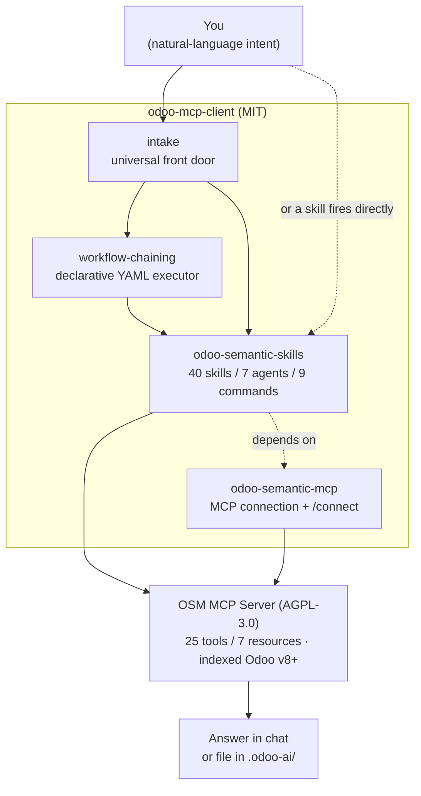

# Odoo MCP Client

[](LICENSE)
[](https://odoo-semantic.viindoo.com/)

> **odoo-mcp-client** is the MIT-licensed client layer that brings the
> [Odoo Semantic MCP server](https://odoo-semantic.viindoo.com/) into your AI agent
> as an Odoo workforce toolkit - covering engineering, sales, marketing, strategy,
> onboarding, and visual UI testing.
> Hosted instance: [`odoo-semantic.viindoo.com`](https://odoo-semantic.viindoo.com) -
> API key and install guide: [`/install`](https://odoo-semantic.viindoo.com/install/)



_All knowledge and computation live on the OSM server; this repo is a thin routing and orchestration layer._

## What is in this repo

This is a **monorepo of two Claude Code plugins** under [`plugins/`](plugins/). Each has its own
detailed README - start there for usage, install, and reference:

| Plugin | What it is | README |
|--------|-----------|--------|
| **[`odoo-semantic-skills`](plugins/odoo-semantic-skills/)** | The full Odoo AI workforce toolkit: **40 skills + 7 agents + 9 commands** across 9 personas, plus **12 declarative workflows** and the drive-to-done orchestration harness. Depends on `odoo-semantic-mcp` (auto-installed). | [README](plugins/odoo-semantic-skills/README.md) |
| **[`odoo-semantic-mcp`](plugins/odoo-semantic-mcp/)** | The thin MCP connection layer: registers the `odoo-semantic` server (**25 tools / 7 resources**) and ships the `/odoo-semantic-mcp:connect` command. Install this alone for raw MCP tools only. | [README](plugins/odoo-semantic-mcp/README.md) |

Most users install **`odoo-semantic-skills`**, which pulls in `odoo-semantic-mcp` automatically as
a declared dependency - the skills, agents, commands, and the MCP connection all arrive in one step.

## Quick install (Claude Code)

**Full toolkit (recommended)** - skills + agents + commands + MCP, in three steps:

```
/plugin marketplace add Viindoo/claude-plugins   # one-time, if not already registered
/plugin install odoo-semantic-skills@viindoo-plugins   # auto-pulls odoo-semantic-mcp
/odoo-semantic-mcp:connect
```

**MCP-only** - if you only want the MCP tools (no persona skills/agents/commands):

```
/plugin install odoo-semantic-mcp@viindoo-plugins
/odoo-semantic-mcp:connect
```

Either way, **restart Claude Code** afterward so the MCP tools load. You will need an **API key**
(format `osm_...`) from the [install page](https://odoo-semantic.viindoo.com/install/) and the
**MCP server URL** (default `https://odoo-semantic.viindoo.com/mcp`). Per-plugin install notes,
browser MCP setup, and other-AI-tool configs are in each plugin's README.

## Migration / upgrading from v1.x

The single `odoo-semantic` plugin has been **split and renamed** into `odoo-semantic-skills`
and `odoo-semantic-mcp`. If you previously installed the old `odoo-semantic` plugin, uninstall
it and reinstall the new plugins:

```
/plugin uninstall odoo-semantic@viindoo-plugins
/plugin install odoo-semantic-skills@viindoo-plugins   # auto-pulls odoo-semantic-mcp
/odoo-semantic-mcp:connect
```

Then **restart Claude Code**.

> **Note:** your API key + MCP URL must be re-entered after installing the new MCP plugin -
> `/odoo-semantic-mcp:connect` will prompt for them again. The MCP server name (`odoo-semantic`,
> tools `mcp__odoo-semantic__*`) is unchanged, so anything that references the tool namespace
> keeps working.

## Requirements

- **Odoo Semantic MCP server URL** - `https://odoo-semantic.viindoo.com/mcp` (or your self-hosted instance)
- **API key** - format `osm_<alphanumeric>`, obtain from the [install page](https://odoo-semantic.viindoo.com/install/)
- Claude Code with MCP support (v2.1.x or newer)

## For contributors - local dev install

**Prerequisite:** Python 3.12+ (needed by `make setup` / `make test`).

Test changes from a checkout without going through the marketplace. Each plugin lives
under `plugins/` - point `--plugin-dir` at the one you are working on:

```bash
claude --plugin-dir ./plugins/odoo-semantic-skills   # skills + agents + commands
claude --plugin-dir ./plugins/odoo-semantic-mcp      # MCP connection + connect command
```

See [`CONTRIBUTING.md`](CONTRIBUTING.md) for the full plugin-dev workflow, the release /
SHA-pinning pipeline, and the DCO sign-off requirement.

## Relationship to the server

| Layer | Repository | License |
|-------|------------|---------|
| Client (this repo) - plugins, skills, agents, snippets | `Viindoo/odoo-mcp-client` | MIT |
| Server - indexer, Neo4j graph, pgvector, MCP server, web UI | [odoo-semantic.viindoo.com](https://odoo-semantic.viindoo.com/) | AGPL-3.0-or-later |

To use the hosted instance, sign up for an API key at
[odoo-semantic.viindoo.com/install](https://odoo-semantic.viindoo.com/install/).
Self-hosting instructions are available in the server's own documentation,
accessible after registration.

## License

MIT - see [LICENSE](LICENSE) and [NOTICE](NOTICE). Brand assets in `branding/` are
trademarks of Viindoo Technology JSC and are not covered by the MIT grant - see
[`branding/TRADEMARK.md`](branding/TRADEMARK.md).
