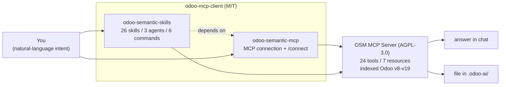
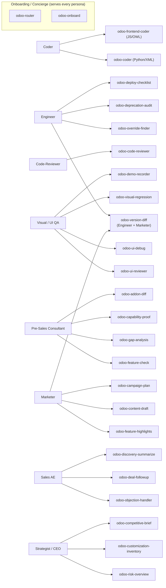
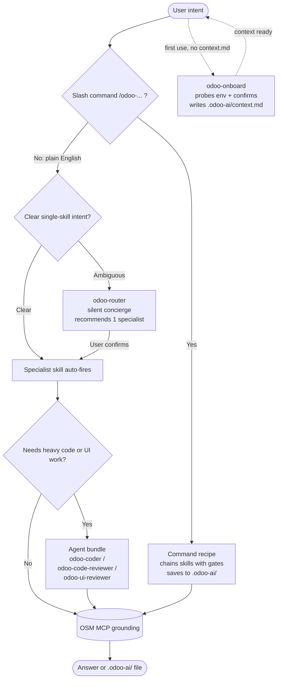
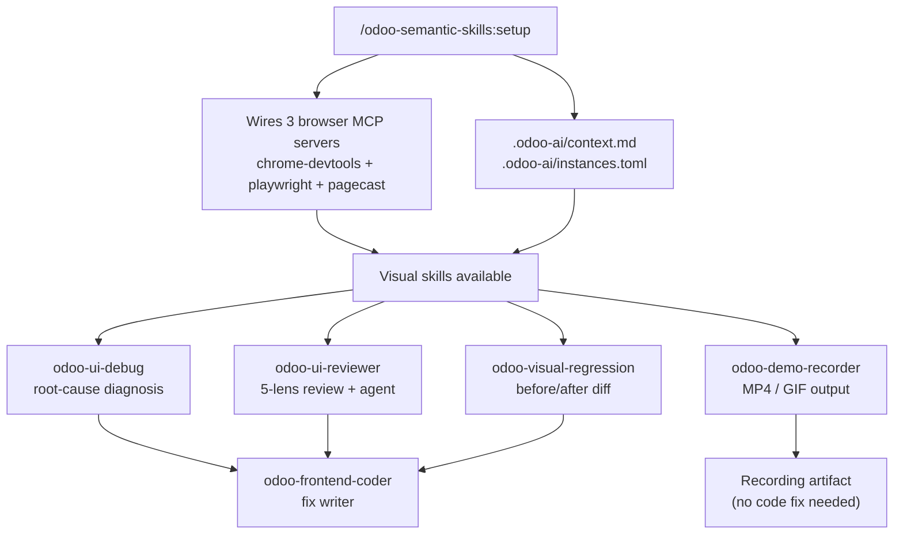

# Odoo MCP Client

[](LICENSE)
[](https://odoo-semantic.viindoo.com/)

> **odoo-mcp-client** is the MIT-licensed client layer that brings the
> [Odoo Semantic MCP server](https://odoo-semantic.viindoo.com/) into your AI agent
> as an Odoo workforce toolkit - covering engineering, sales, marketing, strategy,
> onboarding, and visual UI testing.
> Hosted instance: [`odoo-semantic.viindoo.com`](https://odoo-semantic.viindoo.com) -
> API key and install guide: [`/install`](https://odoo-semantic.viindoo.com/install/)



_Installing `odoo-semantic-skills` pulls in `odoo-semantic-mcp` automatically (declared dependency). All knowledge and computation live on the OSM server; this repo is a thin routing layer._

## What you get

Nine virtual specialists that self-activate from plain-language intent - no slash
commands to memorize. Describe what you need; the right persona fires automatically.
You do not need to know skill names.

Six workflow commands (`/odoo-bid-respond`, `/odoo-customer-followup-draft`,
`/odoo-discovery-quick`, `/odoo-feature-positioning`, `/odoo-upgrade-plan-full`,
`/odoo-semantic-skills:setup`) chain skills into multi-step recipes and write
structured output to `.odoo-ai/`.

> **Counts at a glance:** `odoo-semantic-skills` ships **26 skills + 3 agents +
> 6 commands**, grouped into **9 persona buckets** for navigation. A 7th slash command,
> `/odoo-semantic-mcp:connect`, belongs to the companion `odoo-semantic-mcp` plugin and
> is pulled in automatically when you install the skills plugin.

## Who is it for



- **Engineer** - Find the correct override point, audit deprecated API usage before an upgrade, or validate a deployment is safe.
- **Coder** - Write Odoo backend (Python/XML) or frontend (JS/OWL) code that is idiomatic and convention-correct, without looking up every framework rule.
- **Code-Reviewer** - Review pull requests or audit patches for ORM misuse, inheritance anti-patterns, security holes, or N+1 query issues.
- **Visual / UI QA** - Review a live Odoo screen through five lenses (aesthetics, function, stability, accessibility, performance), debug a broken render, catch visual regressions, or record a demo clip.
- **Pre-Sales Consultant** - Verify feature availability, build a gap matrix, produce evidence for a proposal, or compare CE vs EE side-by-side.
- **Sales AE** - Get ACA-structured responses to objections, risk-scored follow-up emails for stalled deals, or a synthesized prospect profile from discovery notes.
- **Marketer** - Create content around Odoo features - blog posts, slide decks, social copy, multi-channel campaign plans - in marketing-ready language.
- **Strategist / CEO** - Get an executive risk overview of customizations, a structured customization inventory, or a competitor capability snapshot ready for a board or sales response.
- **Onboarding / Concierge** - Cross-cutting for every persona: `odoo-onboard` bootstraps project context on a new engagement; `odoo-router` takes ambiguous intent and routes it to the right specialist automatically.

### How it works

Skills self-activate from plain-language intent - you describe what you want and the matching specialist fires automatically. When intent is ambiguous or spans two specialists, `odoo-router` acts as a silent concierge: it maps your prompt to exactly one target skill and asks for a single confirmation before any work runs - it never does the work itself. For explicit multi-step workflows, slash commands (`/odoo-bid-respond`, `/odoo-upgrade-plan-full`, and others) let you control the full chain: each command sequences skills with approval gates and saves output to `.odoo-ai/`. On a new Odoo project, `odoo-onboard` bootstraps context automatically - if it detects `__manifest__.py` but no `.odoo-ai/context.md`, it probes your environment, confirms version and module list, and writes `.odoo-ai/context.md` so every later skill skips boilerplate setup. Every skill grounds its answers through the OSM MCP server; output is either a direct answer or a saved file under `.odoo-ai/`.



## Workflows

Commands come in two shapes: multi-phase orchestrators that chain several skills in a
gated sequence, and single-step wrappers that run one skill and offer a save step. The
diagrams below show both, plus the visual UI testing pipeline that `setup` provisions.

```mermaid
flowchart TD
    subgraph BID["/odoo-bid-respond -> .odoo-ai/bids/"]
        B0([Parse args + check context]) --> B1[discovery-summarize]
        B1 -->|Gate 1| B2[gap-analysis]
        B2 -->|Gate 2| B3[capability-proof]
        B3 -->|Gate 3| B4[objection-handler]
        B4 -->|Gate 4| B5[Assemble proposal]
        B5 -->|Gate 5 - save| B6[(bids/LABEL-DATE.md)]
    end

    subgraph POS["/odoo-feature-positioning -> .odoo-ai/positioning/"]
        P0([Parse args + check context]) --> P1[feature-check]
        P1 -->|Gate 1| P2[addon-diff]
        P2 -->|Gate 2 - if 2+ editions| P3[competitive-brief]
        P3 -->|Gate 3 - if competitor named| P4[Positioning copy]
        P4 -->|save| P5[(positioning/SLUG-CHANNEL-DATE.md)]
    end

    subgraph UPG["/odoo-upgrade-plan-full -> .odoo-ai/upgrade-plans/"]
        U0([Parse args + check context]) --> U1[risk-overview]
        U1 -->|Gate 1| U2[deprecation-audit]
        U2 -->|Gate 2| U3[version-diff]
        U3 -->|Gate 3| U4[Action ordering + effort estimate]
        U4 --> U5[Assemble plan]
        U5 -->|Gate 4 - save| U6[(upgrade-plans/SRC-TGT-DATE.md)]
    end

    subgraph WRAP["Single-step wrappers"]
        W1["/odoo-customer-followup-draft"] -->|deal-followup| WS1[(followups/LABEL-DATE.md)]
        W2["/odoo-discovery-quick"] -->|discovery-summarize| WS2[(discovery/LABEL-DATE.md)]
    end
```



The visual UI testing stack is a sibling cluster, not a linear chain: one `setup` step
provisions the browser environment, then four skills run independently and converge on
`odoo-frontend-coder` as the fix writer.



### Available commands

> `/odoo-semantic-mcp:connect` ships in the `odoo-semantic-mcp` plugin and is not counted among the 6 commands of the skills plugin.

| Command | Purpose | Chained skills |
|---------|---------|----------------|
| `/odoo-bid-respond` | Full bid response chain for RFP/requirements documents, saves to `.odoo-ai/bids/` | `odoo-discovery-summarize` -> `odoo-gap-analysis` -> `odoo-capability-proof` -> `odoo-objection-handler` |
| `/odoo-customer-followup-draft` | Sales follow-up email saved to `.odoo-ai/followups/` | `odoo-deal-followup` |
| `/odoo-discovery-quick` | Synthesize discovery notes into a structured profile, saves to `.odoo-ai/discovery/` | `odoo-discovery-summarize` |
| `/odoo-feature-positioning` | Positioning copy for marketing and sales use, saves to `.odoo-ai/positioning/` | `odoo-feature-check` -> `odoo-addon-diff` -> `odoo-competitive-brief` -> positioning copy |
| `/odoo-upgrade-plan-full` | Comprehensive upgrade plan (replaces legacy `odoo-upgrade-planner` agent), saves to `.odoo-ai/upgrade-plans/` | `odoo-risk-overview` -> `odoo-deprecation-audit` -> `odoo-version-diff` -> synthesis |
| `/odoo-semantic-skills:setup` | One-shot idempotent setup for the visual workflow - wires 3 browser MCP servers across Claude/Codex/Gemini, installs browser deps, auto-allows tool permissions, discovers + optionally spins up a local Odoo instance | - |

## Use cases - day in the life

### Use case 1 - Sales AE: stalled deal, draft a follow-up email in 30 seconds

A manufacturing SME prospect has not replied in 21 days after the demo. Pipeline stage is "evaluation." You need a follow-up email tonight to send tomorrow morning.

```
You: "Deal with Customer A stalled 21 days after demo, manufacturing SME evaluating
Odoo vs SAP. At the last meeting they promised technical feedback within the week.
Write a follow-up email."
```

Skill `odoo-deal-followup` fires. Output: risk score (red - warm lead, >14 days no reply), next-best-action ("re-engage with concrete value proof"), and a 4-paragraph follow-up email ready to paste. To save it: `/odoo-customer-followup-draft` chains the skill and writes to `.odoo-ai/followups/customer-a-2026-MM-DD.md`.

### Use case 2 - Pre-Sales: RFP with 15 requirements

A prospect sends an RFP with 15 functional requirements: lot tracking, multi-level approval, reporting, multi-warehouse, customer portal, and more. You need a complete response within 24 hours.

```
You: "/odoo-bid-respond - Customer B (F&B chain, 50 locations), 15 requirements listed below"
```

The command runs a gated workflow: `odoo-discovery-summarize` (prospect profile) -> `odoo-gap-analysis` (effort matrix: Standard / Config / Extension / Custom + S/M/L/XL days) -> `odoo-capability-proof` (evidence for covered items) -> `odoo-objection-handler` (2-3 anticipated objections) -> assemble proposal -> save to `.odoo-ai/bids/customer-b-2026-MM-DD.md`. You approve each phase before the next fires.

### Use case 3 - Strategist / founder: monthly board brief

You need a board status brief covering product progress, pipeline health, competitive landscape, and top risks before next week's investor meeting.

```
You: "Summarize competitive landscape - Competitor A vs your Odoo distribution -
for next week's board meeting."
```

Skill `odoo-competitive-brief` fires. Paste your collected signals; the skill structures them into a market snapshot, capability matrix, GTM moves, threat assessment, and recommended product response - ready for a board deck. Combine with `odoo-risk-overview` (founder-level engineering risk dashboard) and `odoo-customization-inventory` (all custom modules with business purpose, M&A due-diligence ready).

### Use case 4 - Engineer + Coder: upgrade v15 to v17

Customer C is running Odoo 15 with 12 custom modules and wants to move to v17 in Q3.

```
You: "/odoo-upgrade-plan-full - Customer C, v15 to v17, 12 custom modules, deadline Q3"
```

Chains `odoo-risk-overview` -> `odoo-deprecation-audit` -> `odoo-version-diff` -> synthesis. Output: executive risk overview, code-level deprecation findings, API/feature diff, action ordering, S/M/L/XL effort estimate, and rollback plan. Saves to `.odoo-ai/upgrade-plans/customer-c-v15-v17-2026-MM-DD.md`. When you need actual code written, invoke the `odoo-coder` agent bundle (depth-1 safe, restricted-tool autonomy, OSM access, optional cost-free local model).

### Use case 5 - Marketer: launch a new feature campaign

You just shipped a new inventory forecasting feature and need launch positioning plus ready-to-publish copy for blog, LinkedIn, and email.

```
You: "/odoo-feature-positioning - inventory forecasting module, target SME manufacturers,
launch window 2 weeks, main competitor SAP Business One"
```

The command chains `odoo-feature-check` (verifies the feature and reads its scope from OSM) -> `odoo-addon-diff` (CE vs EE edition framing) -> `odoo-competitive-brief` (how it lands against SAP B1) -> positioning synthesis. Output: a one-line value proposition, three proof points, objection rebuttals, and channel-by-channel copy. Saves to `.odoo-ai/positioning/inventory-forecasting-2026-MM-DD.md`. For a full multi-week campaign blueprint, follow up with `odoo-campaign-plan`; for per-asset drafts (blog, email sequence, social), call `odoo-content-draft`.

### Use case 6 - QA / Visual: catch visual regressions after installing a module

Your team just installed a third-party module and you need to confirm no existing screens broke before handing off to the client.

```
You: "Run visual regression on the invoicing list and form views after installing
module account_followup on Customer D's staging instance."
```

Run `/odoo-semantic-skills:setup` once to provision the browser automation stack. Then skill `odoo-visual-regression` fires: it captures before/after screenshots of targeted views, diffs them, and flags regressions with severity labels. Where a defect is confirmed, `odoo-ui-reviewer` follows up with a 5-lens audit (aesthetics / function / stability / accessibility / performance) and surfaces the exact CSS or XML path to fix. Fixes are handed to `odoo-frontend-coder`, which writes the override and shows a patch preview before applying.

### Frequently asked questions

**I only need one skill - do I have to know all 26?** No. Skills auto-fire by intent match. Describe what you need; the right skill triggers.

**What if the OSM server is offline?** Each skill has a `## Standalone-first fallback` section - it degrades gracefully by prompting you to paste data manually. The plugin does not break when OSM is offline.

**What about confidentiality?** Plugin code is public (MIT). Skills contain no customer-specific data or pricing. A pre-commit hook and CI scan block several categories of sensitive content. Examples use abstract labels (Customer A, Customer B, Customer C, Customer D).

**Multi-runtime?** Skills and commands are written for Claude Code. Codex/Gemini parity is smoke-tested in `tests/smoke/runtime_parity.md` - 10 representative skills verified across all three runtimes.

## Quick install (Claude Code - 3 steps, all required)

Inside Claude Code, run:

```
/plugin marketplace add Viindoo/claude-plugins   # one-time, if not already registered
/plugin install odoo-semantic-skills@viindoo-plugins   # auto-pulls odoo-semantic-mcp
/odoo-semantic-mcp:connect
```

Installing `odoo-semantic-skills` **automatically pulls in `odoo-semantic-mcp`** via the plugin dependency, so you get the skills, agents, commands, and the MCP connection in one step.

> **MCP-only?** If you only want the MCP tools (no persona skills/agents/commands), install just the MCP plugin instead:
>
> ```
> /plugin install odoo-semantic-mcp@viindoo-plugins
> /odoo-semantic-mcp:connect
> ```

You will need an **API key** (format `osm_...`) from the [install page](https://odoo-semantic.viindoo.com/install/), and the **MCP server URL** (default `https://odoo-semantic.viindoo.com/mcp`).

<details>
<summary>Known Claude Code bugs affecting this install (v2.1.x)</summary>

**Bug 1 - `userConfig` not prompted at install time**
([#39455](https://github.com/anthropics/claude-code/issues/39455), [#39827](https://github.com/anthropics/claude-code/issues/39827))
Plugin manifests use a `userConfig` block to collect the API key + MCP URL, but the CLI does not prompt for those values at install time. Without running `/odoo-semantic-mcp:connect` the plugin loads its skills but the MCP server silently fails - `claude mcp list` will not show `odoo-semantic`. This is why the connect step is **mandatory**.

**Bug 2 - MCP servers not hot-reloaded within a session**
([#46426](https://github.com/anthropics/claude-code/issues/46426) - "not planned")
After running `/odoo-semantic-mcp:connect`, you must **restart Claude Code** for the MCP tools to load. The connect command verifies the server via `curl` and tells you when to restart.

</details>

## Migration / upgrading from v1.x

The single `odoo-semantic` plugin has been **split and renamed** into `odoo-semantic-skills`
and `odoo-semantic-mcp`. If you previously installed the old `odoo-semantic` plugin, uninstall
it and reinstall the new plugins:

```
/plugin uninstall odoo-semantic@viindoo-plugins
/plugin install odoo-semantic-skills@viindoo-plugins   # auto-pulls odoo-semantic-mcp
/odoo-semantic-mcp:connect
```

Then **restart Claude Code**.

> **Note:** your API key + MCP URL must be re-entered after installing the new MCP plugin -
> `/odoo-semantic-mcp:connect` will prompt for them again. The MCP server name (`odoo-semantic`,
> tools `mcp__odoo-semantic__*`) is unchanged, so anything that references the tool namespace
> keeps working.

## Reference

### Skills (26)

Per-persona quick-start guides live in [`docs/personas/`](plugins/odoo-semantic-skills/docs/personas/).

| Skill | Persona | Description |
|-------|---------|-------------|
| `odoo-risk-overview` | Strategist / CEO | Executive risk overview of customizations before upgrade |
| `odoo-customization-inventory` | Strategist / CEO | Structured inventory of all custom modules and their business purpose |
| `odoo-competitive-brief` | Strategist | Competitor capability snapshot structured for board or sales response |
| `odoo-override-finder` | Engineer | Find the correct override point and pattern for a method |
| `odoo-deprecation-audit` | Engineer | Audit deprecated API usage for upgrade readiness |
| `odoo-deploy-checklist` | Engineer | Pre-deployment safety checklist covering config, migration, and rollback |
| `odoo-version-diff` | Engineer + Marketer | Categorized diff of API and feature changes between versions |
| `odoo-coder` | Coder | Python/XML backend coder with Odoo conventions baked in (slim, paired with agent bundle) |
| `odoo-frontend-coder` | Coder | JS/OWL coder merging legacy web client (v8-14) and OWL component framework (v15+) |
| `odoo-code-reviewer` | Code-Reviewer | Review Odoo patches for ORM/inheritance/security pitfalls (slim, paired with agent bundle) |
| `odoo-feature-check` | Pre-Sales Consultant | Check if a feature exists in standard CE or EE |
| `odoo-gap-analysis` | Pre-Sales Consultant | Gap matrix of client requirements vs. standard Odoo |
| `odoo-capability-proof` | Pre-Sales Consultant | Evidence-based proof that Odoo supports a client requirement |
| `odoo-addon-diff` | Pre-Sales Consultant | Side-by-side CE vs EE feature comparison |
| `odoo-objection-handler` | Sales AE | ACA-structured responses to capability objections |
| `odoo-deal-followup` | Sales AE | Risk-scored follow-up email for stalled deals with next-best-action |
| `odoo-discovery-summarize` | Sales AE | Synthesize discovery session notes into a structured prospect profile |
| `odoo-feature-highlights` | Marketer | Marketing-friendly feature highlights for a version |
| `odoo-content-draft` | Marketer | Draft blog posts, slide decks, or social content around Odoo features |
| `odoo-campaign-plan` | Marketer | Multi-channel campaign plan from a positioning brief |
| `odoo-onboard` | Onboarding / Concierge | Bootstrap project context into `.odoo-ai/context.md` for new engagements |
| `odoo-router` | Onboarding / Concierge | Concierge skill - routes ambiguous user intent to the right specialist |
| `odoo-ui-reviewer` | Coder / Visual | Five-lens review of a rendered Odoo screen in a live browser (aesthetics, function, stability, accessibility, performance); slim, paired with agent bundle |
| `odoo-ui-debug` | Coder / Visual | Root-cause a broken Odoo UI at runtime (console errors, failed requests, blank OWL renders, wrong CSS) and pinpoint the override point |
| `odoo-visual-regression` | Coder / Visual | Screenshot baseline + diff between two Odoo states (before/after upgrade, module install, theme change) with blast-radius assessment |
| `odoo-demo-recorder` | Coder / Visual | Record an MP4/GIF screen-capture of a scripted Odoo click-path for a demo, sales walkthrough, or marketing clip |

### Agents (3)

| Agent | Model | Role |
|-------|-------|------|
| `odoo-coder` | Sonnet | Agent bundle for code writing - invoked by main agent and commands; depth-1 safe with restricted-tool autonomy |
| `odoo-code-reviewer` | Sonnet | Agent bundle for code review - runs full PR-scope analysis with OSM grounding |
| `odoo-ui-reviewer` | Sonnet | Agent bundle for visual UI review - drives a live browser through a five-lens audit with screenshot, console, and Lighthouse evidence plus OSM source pointers |

### MCP resources

The server exposes **7 resource URI templates** and **24 tools**. Full URI descriptions, parameter reference, and usage examples are in [`docs/setup.md`](plugins/odoo-semantic-skills/docs/setup.md#mcp-resources-odoo-uri-scheme-v05).

Supported Odoo versions: **v8.0 through v19.0 (12 versions)**.

### Connect command

`/odoo-semantic-mcp:connect` ships in the `odoo-semantic-mcp` plugin. It prompts for your MCP server URL and API key, validates the key format (`osm_...`), registers the server via `claude mcp add --scope user`, probes the server health endpoint, and pre-approves all `mcp__odoo-semantic__*` tools in `~/.claude/settings.json` (idempotent). Full parameter details and the manual snippet for `permissions.allow` are in [`docs/setup.md#claude-code-auto-trust`](plugins/odoo-semantic-skills/docs/setup.md#claude-code-auto-trust).

## Other AI tools

The plugin is Claude Code only. For other tools, paste the matching MCP config - see
[`docs/setup.md`](plugins/odoo-semantic-skills/docs/setup.md) for full per-client walkthroughs (Codex, Gemini, VS Code,
Antigravity, Windsurf, Zed, JetBrains Junie) and `snippets/` for copy-ready configs:

| Tool | Snippet |
|------|---------|
| Cursor | [`snippets/cursor-mcp.json`](plugins/odoo-semantic-skills/snippets/cursor-mcp.json) (server config) + [`snippets/cursor-rules.md`](plugins/odoo-semantic-skills/snippets/cursor-rules.md) (routing rules) |
| ChatGPT Custom GPT | [`snippets/openai-gpt-instructions.md`](plugins/odoo-semantic-skills/snippets/openai-gpt-instructions.md) |
| Google Gemini Gem | [`snippets/gemini-gem-instructions.md`](plugins/odoo-semantic-skills/snippets/gemini-gem-instructions.md) |
| Continue.dev | [`snippets/continue-dev-mcp.yaml`](plugins/odoo-semantic-skills/snippets/continue-dev-mcp.yaml) (MCP server config) |
| JetBrains AI Assistant | [`snippets/jetbrains-mcp-config.md`](plugins/odoo-semantic-skills/snippets/jetbrains-mcp-config.md) (setup guide) |
| VS Code (v1.99+) | [`snippets/vscode-mcp.json`](plugins/odoo-semantic-skills/snippets/vscode-mcp.json) (top-level key is `servers`, not `mcpServers`) |
| Google Antigravity | [`snippets/antigravity-mcp.json`](plugins/odoo-semantic-skills/snippets/antigravity-mcp.json) (uses `serverUrl`, not `url`) |
| Zed | [`snippets/zed-mcp.json`](plugins/odoo-semantic-skills/snippets/zed-mcp.json) (`context_servers` key, native HTTP - older Zed needs the `mcp-remote` proxy) |
| Windsurf | [`snippets/windsurf-mcp.json`](plugins/odoo-semantic-skills/snippets/windsurf-mcp.json) (uses `serverUrl`, not `url`) |
| JetBrains Junie | [`snippets/junie-mcp.json`](plugins/odoo-semantic-skills/snippets/junie-mcp.json) (place in `.junie/mcp/mcp.json` in your project) |

## Requirements

- **Odoo Semantic MCP server URL** - `https://odoo-semantic.viindoo.com/mcp` (or your self-hosted instance)
- **API key** - format `osm_<alphanumeric>`, obtain from the [install page](https://odoo-semantic.viindoo.com/install/)
- Claude Code with MCP support (v2.1.x or newer)

## For contributors - local dev install

Test changes from a checkout without going through the marketplace. Each plugin lives
under `plugins/` - point `--plugin-dir` at the one you are working on:

```bash
claude --plugin-dir ./plugins/odoo-semantic-skills   # skills + agents + commands
claude --plugin-dir ./plugins/odoo-semantic-mcp      # MCP connection + connect command
```

See [`CONTRIBUTING.md`](CONTRIBUTING.md) for the full plugin-dev workflow, the release /
SHA-pinning pipeline, and the DCO sign-off requirement.

## Relationship to the server

| Layer | Repository | License |
|-------|------------|---------|
| Client (this repo) - plugin, skills, agents, snippets | `Viindoo/odoo-mcp-client` | MIT |
| Server - indexer, Neo4j graph, pgvector, MCP server, web UI | [odoo-semantic.viindoo.com](https://odoo-semantic.viindoo.com/) | AGPL-3.0-or-later |

To use the hosted instance, sign up for an API key at
[odoo-semantic.viindoo.com/install](https://odoo-semantic.viindoo.com/install/).
Self-hosting instructions are available in the server's own documentation,
accessible after registration.

## License

MIT - see [LICENSE](LICENSE) and [NOTICE](NOTICE). Brand assets in `branding/` are
trademarks of Viindoo Technology JSC and are not covered by the MIT grant - see
[`branding/TRADEMARK.md`](branding/TRADEMARK.md).
