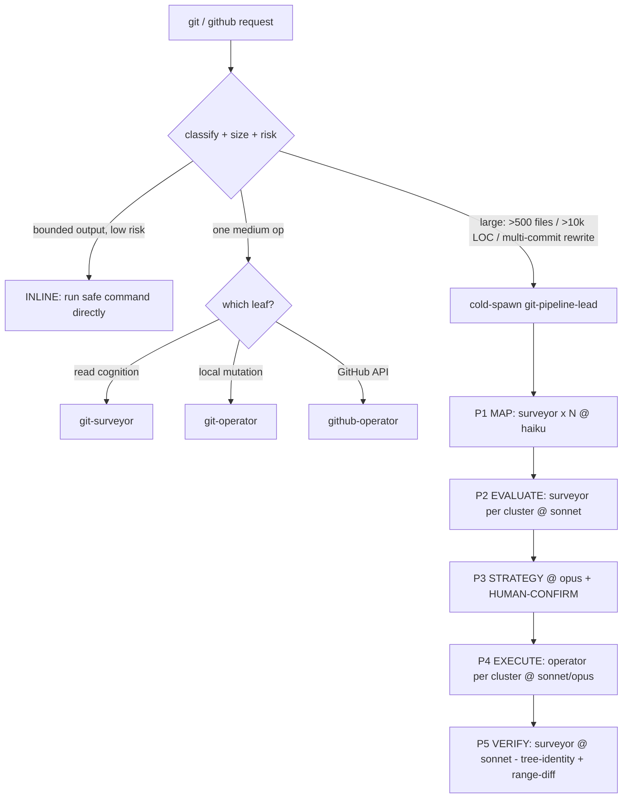
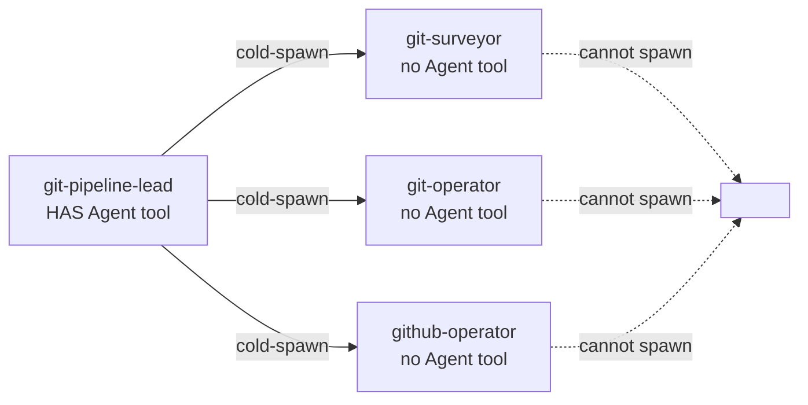
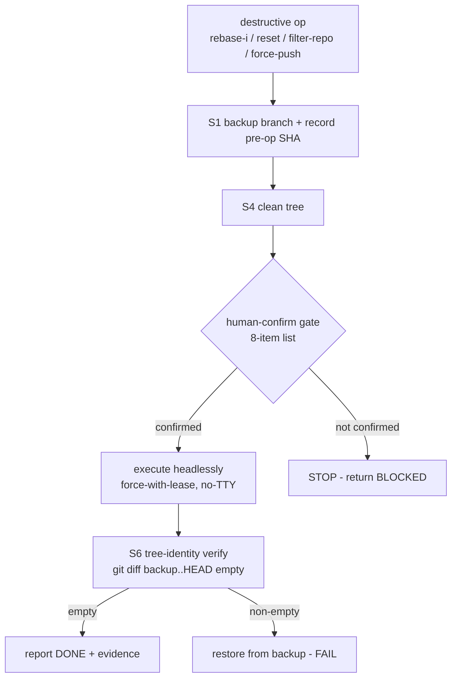

# git-toolkit architecture

`git-toolkit` is a routing + orchestration layer made of Markdown: one front-door skill classifies a
git/github request and runs it in a delegated (or inline-bounded) context, so the CALLER'S context
stays clean and code is never lost. No application logic - the skill and agents are prose with YAML
frontmatter; the actual work is `git`/`gh`/GitHub-MCP commands the agents issue at runtime.

## Components

- **1 skill - `git-ops`.** The universal front door. Auto-triggers on all git + GitHub intent
  (EN + VI). Classifies the op, picks an execution mode, points at the safety/scale/convention
  snippets and the detailed recipes in `references/`.
- **4 agents.**
  - `git-surveyor` - READ-ONLY cognition (map / evaluate / verify). Tool grant excludes write and
    spawn tools.
  - `git-operator` - local mutation (integration + destructive rewrite) under the safety contract.
    No spawn tool.
  - `github-operator` - GitHub API, MCP-first / gh-fallback. No spawn tool.
  - `git-pipeline-lead` - the BRAIN + ORCHESTRATOR for large changes; the ONLY agent that spawns.
- **7 snippets (SSOT).** safety-contract, scale-protocol, nesting-protocol, delegation-decision,
  github-mcp-first, commit-convention, language-mirroring. Each rule is declared ONCE; the skill and
  agents POINT at it via `${CLAUDE_PLUGIN_ROOT}/snippets/...`, never duplicate it.
- **6 references.** large-change-pipeline, history-rewrite, conflict-resolution, github-pipeline,
  and the two commit-convention standards (general, odoo) - deterministic recipes loaded on demand.

## Execution modes (the skill decides)

## Depth guard (anti-runaway)

Only `git-pipeline-lead` holds the spawn tool; the three leaves declare a `tools:` allowlist that
excludes it, hard-capping nesting at two levels (lead -> leaf). All nesting is COLD-SPAWN (stateless
brief in, findings file out) - robust at any caller depth, no team lead needed.

## Safety gate (destructive ops)

## Primary callers

`odoo-ai-agents` business skills (`wave`, `odoo-git-rebase`, `odoo-forward-port`) are the
primary delegating consumers: they orchestrate all local git mutations and GitHub API ops by
dispatching git-toolkit agents (git-operator, git-surveyor, github-operator) rather than running
git commands inline. The delegation contract lives in the odoo-ai-agents plugin at
`snippets/git-delegation.md`. WI leaf-workers these skills spawn are explicitly banned from
issuing git commands and are restricted to their assigned worktree only.

## Dependency

`git-toolkit` declares `"dependencies": ["github"]`. The `github` plugin (default
`claude-plugins-official` marketplace) auto-installs and provides the
`mcp__plugin_github_github__*` tool surface. It authenticates with `GITHUB_PERSONAL_ACCESS_TOKEN`;
when that is absent, `github-operator` falls back to the `gh` CLI (its own auth). See
`${CLAUDE_PLUGIN_ROOT}/snippets/github-mcp-first.md`.
