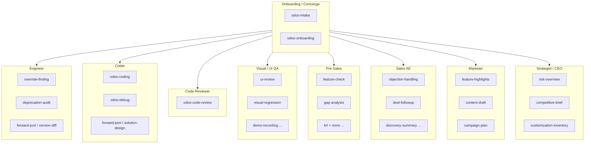
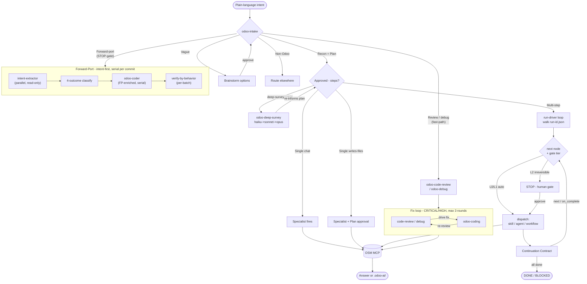
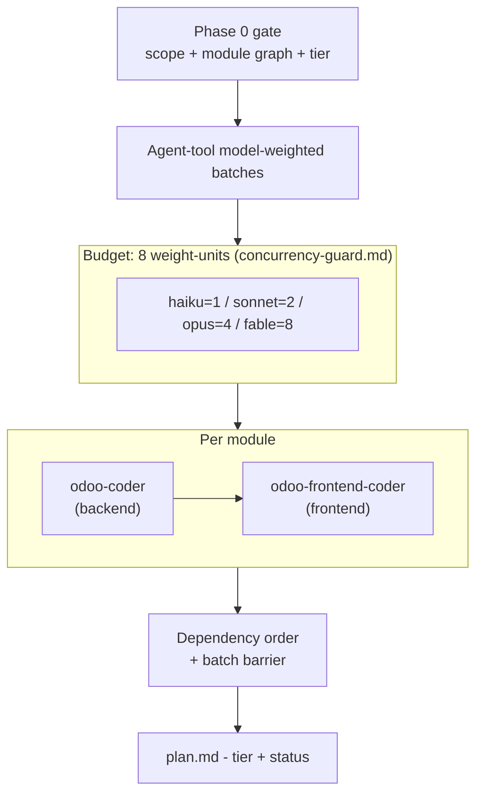
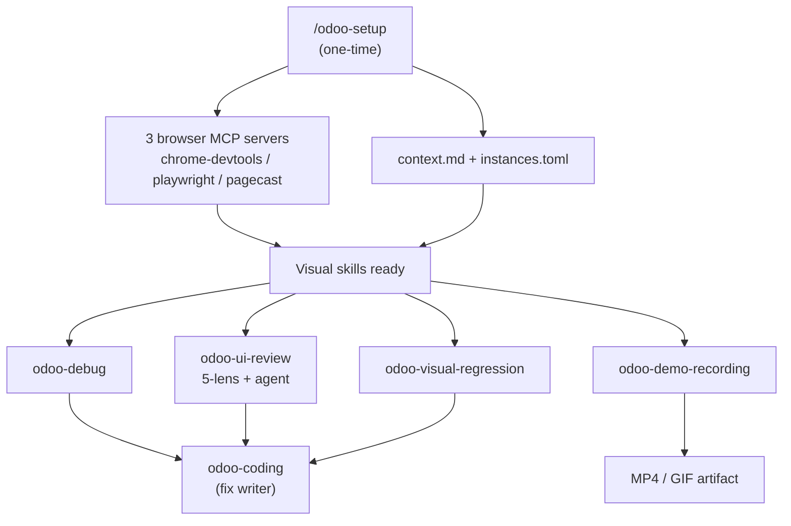
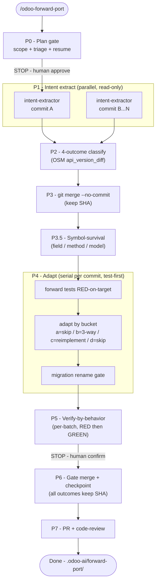

# Odoo AI Agent Team

> Plugin slug: `odoo-ai-agents`

[](../../LICENSE)
[](https://odoo-semantic.viindoo.com/)

> The Odoo AI workforce toolkit: **42 skills + 8 agents + 10 commands**, grouped into **9 persona
> buckets**, plus **12 declarative workflows** - covering engineering, coding, code review, visual
> UI testing, pre-sales, sales, marketing, strategy, onboarding, and cross-version forward-porting. Installing this plugin pulls
> in the companion [`odoo-semantic-mcp`](../odoo-semantic-mcp/) plugin automatically (declared
> dependency), so all knowledge is grounded through the OSM MCP server. This repo is a thin
> routing and orchestration layer; computation lives on the server.

## What you get

Nine virtual specialists that self-activate from plain-language intent - no slash
commands to memorize. Describe what you need; the right persona fires automatically.
You do not need to know skill names.

`odoo-intake` is the universal front door. Say what you want in plain language and it plans the
whole job once, then drives it to done:
- **Vague intent** -> it brainstorms with you (clarifying options, no open-ended "what do you want?").
- **Clear single-step intent** -> it fast-paths straight to the matching specialist. A **review,
  PR-review, or debug** intent fast-paths to `odoo-code-review` / `odoo-debug` with no Plan Mode at
  all - and on a CRITICAL/HIGH finding that specialist **autonomously drives the fix** through
  `odoo-coding` and re-reviews to verify (review -> code -> review, bounded to 3 rounds then escalates).
- **Large / open-ended job** -> it can offer an opt-in **`deep-survey`**: a read-only, multi-phase
  pass (broad haiku sweep -> narrow sonnet dives -> optional opus) that writes a synthesis under
  `.odoo-ai/survey/` and re-informs a sharper plan before any code is written.
- **Multi-step intent** -> it lays out a plan (the work-items, their order, who does each), you
  approve once, and then it **advances step-to-step on its own** - dispatching each specialist,
  reading the result, and moving to the next - stopping only when a step is irreversible/outward
  (e.g. a git push or an email to a customer) or when it is blocked and needs you.

You control how hands-off this is with one optional flag (`--auto` is the default; see
[Drive to done](#drive-to-done-how-to-use-it)). No execution ever fires before you approve the
plan, and the main agent is never forced or trapped - the stops are real human checkpoints, the
nudges are advisory.

A first-class **forward-port pipeline** (`/odoo-forward-port`) is also included: an 8-phase
orchestration that ports commits across Odoo series using intent-first extraction (not raw
code carry-over), merge-keep-SHA strategy, symbol-survival checking, adaptive test forwarding,
and verify-by-behavior per batch. It runs alongside coding, code review, and upgrade planning
as a core engineering capability.

> **Counts at a glance:** this plugin ships **42 skills + 8 agents + 10 commands**, grouped into
> **9 persona buckets** for navigation, plus **12 declarative workflows** driven by
> `workflows/*.workflow.yaml`. A further slash command, `/odoo-semantic-mcp:connect`, belongs to
> the companion `odoo-semantic-mcp` plugin and is pulled in automatically when you install this one.

## Who is it for



- **Engineer** - Find the correct override point, audit deprecated API usage before an upgrade, or validate a deployment is safe.
- **Coder** - Write Odoo backend (Python/XML) or frontend (JS/OWL) code that is idiomatic and convention-correct, without looking up every framework rule.
- **Code-Reviewer** - Review pull requests or audit patches for ORM misuse, inheritance anti-patterns, security holes, or N+1 query issues.
- **Visual / UI QA** - Review a live Odoo screen through five lenses (aesthetics, function, stability, accessibility, performance), debug a broken render, catch visual regressions, record a demo clip, or run a full QA pipeline (test cases + checklist + bug triage).
- **Pre-Sales Consultant** - Verify feature availability, build a gap matrix, produce evidence for a proposal, compare CE vs EE side-by-side, or classify and cost hundreds of business requirements at scale with the BRL engine.
- **Sales AE** - Get ACA-structured responses to objections, risk-scored follow-up emails for stalled deals, a synthesized prospect profile from discovery notes, or triage an inbound support ticket into a customer-ready resolution draft.
- **Marketer** - Create content around Odoo features - blog posts, slide decks, social copy, multi-channel campaign plans - in marketing-ready language.
- **Strategist / CEO** - Get an executive risk overview of customizations, a structured customization inventory, or a competitor capability snapshot ready for a board or sales response.
- **Onboarding / Concierge** - Cross-cutting for every persona: `odoo-onboarding` bootstraps project context on a new engagement; `odoo-intake` takes ambiguous intent, brainstorms when vague, fast-paths when clear, routes to the right workflow or specialist, and always proposes a plan before any execution skill fires.

### How it works

Everything runs through the **main agent**, which acts as an **orchestrator + decision-maker
only** - it routes, decides at gates, and delegates the heavy work to specialists so its own
context stays clean across a long session. Roles: orchestrating context (main agent) ->
dispatched specialist (skill/workflow) -> leaf-worker (fan-out/worktree worker).

`odoo-intake` is the front door for any plain-language intent. It (1) closes an intent gate (what /
why / what-done), (2) resolves the Odoo version - escalating to `odoo-onboarding` to pick
version/profile when it is unknown and OSM is reachable (inline-menu fallback), or asking you for
the version + repo path when OSM is down - (3) runs a quick read-only **recon** to make the plan
context-aware, then (4) emits a **Proposed Plan** and waits for your approval. From there:

- **Review / PR-review or debug intent** -> **fast-paths** straight to `odoo-code-review` /
  `odoo-debug`, skipping the planning ceremony (no Proposed-Plan block, no Plan Mode).
- **Single clear step** -> the one specialist fires; chat-only answers skip Plan Mode entirely.
- **Opt-in deep-survey** (offered on large jobs) -> if you approve `deep-survey`, `odoo-deep-survey`
  fans out a broad haiku sweep -> narrow sonnet dives -> an optional opus pass and writes a synthesis
  under `.odoo-ai/survey/` that re-informs a sharper Proposed Plan before any execution.
- **Multi-step** -> `odoo-intake` writes the approved plan to a run file (`.odoo-ai/run-<id>.json`) and
  hands it to **`run-driver`**, which walks the work-items to `DONE` / `BLOCKED` / `NEEDS_CONTEXT`:
  pick the next ready node -> check its gate tier -> dispatch it (a leaf skill inline, a coding/
  review/UI **agent bundle**, or a declarative **workflow** via `workflow-chaining`) -> read the
  step's **Continuation Contract** -> advance. A step can chain the next one (including across
  workflows via `on_complete`), so the run keeps moving without re-prompting.

Each step carries a **gate tier** that decides what stops for you (see
[Drive to done](#drive-to-done-how-to-use-it)). On a new Odoo project, `odoo-onboarding`
bootstraps `.odoo-ai/context.md` so later skills skip setup. Every skill grounds its answers
through the OSM MCP server; output is a direct answer or a file under `.odoo-ai/`.



### Drive to done - how to use it

Two dials decide how much the run does on its own and where it stops for you.

**1. Autonomy dial** (optional flag on your `/odoo-intake` request; default `--auto`):

| Flag | Behavior | Use when |
|------|----------|----------|
| `--auto` *(default)* | Drives the whole plan to done; stops only at irreversible/outward steps (**L2**) and when blocked | You want hands-off; you trust the approved plan |
| `--step` | Stops at **every** writes-files step for confirmation | High-stakes work; you want to inspect each change |
| `--plan` | Produces the plan (work-items + order) and stops - runs nothing | You just want the plan/estimate |

**2. Gate tiers** - every step is tagged, and the tier (not the dial) is what ultimately decides
a human stop. **L2 always stops for a human; the dial can never lower it.**

| Tier | What it is | Under `--auto` |
|------|-----------|----------------|
| **L0** | Read-only / chat answers | Auto-passes |
| **L1** | Writes internal files under `.odoo-ai/` (reversible, gitignored) | Auto-passes |
| **L2** | Irreversible / outward: git push or merge, sending to a customer, touching a live instance - **and any source-code write that was not in the approved plan** | **Always stops for you** |

**Best practice.** Start with a plain-language `/odoo-intake "<what you want>"`. Approve the plan once.
Let `--auto` carry the routine steps; you will be stopped exactly at the moments that matter
(anything leaving your machine or touching a customer/instance). Use `--step` when you want to
watch every edit, `--plan` when you only want the map. You never type a skill name.

> **For contributors / AI agents extending this plugin:** the authoritative, diagram-backed
> spec of this whole mechanism - the Continuation Contract, the `run-<id>.json` blackboard, the
> gate-tier derivation, the depth rules, and the command/skill/agent taxonomy - lives in
> [`docs/reference/workflow-harness.md` §8](docs/reference/workflow-harness.md).
> The per-skill orchestration registry (spawn class, depth policy, output mode, gate tier) is
> [`docs/reference/ORCHESTRATION-MAP.md`](docs/reference/ORCHESTRATION-MAP.md),
> generated from `generator/skill_tool_deps.json`. Read those before changing routing or gates.

### Coding dispatch and model tiers

When a coding job spans several modules, `odoo-coding` assigns each module a **deterministic model
tier** at its Phase 0 gate - `haiku` (trivial boilerplate), `sonnet` (default), `opus` (core
override / cross-model / migration), or `fable` (rare Custom-XL, ~2x opus price, design-doc-first) -
recorded in the gate table and `plan.md`. It then dispatches the `odoo-coder` (backend) and
`odoo-frontend-coder` (frontend) agents via the **Agent tool** in **model-weighted batches**: per
module the backend leg runs before the frontend leg, modules are ordered so each runs after its
in-set dependencies, and each round packs work up to a single model-weighted budget (the OOM
envelope), whose SSOT is [`skills/_shared/concurrency-guard.md`](skills/_shared/concurrency-guard.md):
WEIGHT `haiku=1 / sonnet=2 / opus=4 / fable=8`, at most **8 weight-units in flight** (so opus
throttles to 2 concurrent and fable runs exclusive). The plugin does NOT use the Claude Code
Workflow tool (JS) for codegen - all fan-out is real Agent-tool calls.

The agent frontmatter `model:` is only a default - the dispatch `model` parameter overrides it per
work-item in either direction (same convention as `odoo-debug` and `odoo-solution-design`).



## Workflows

The plugin ships 12 declarative workflows in `workflows/*.workflow.yaml`. Each workflow is
executed by the generic `workflow-chaining` skill, which reads the YAML and runs the declared
phase sequence with approval gates between phases. Adding a new workflow is a single YAML
file drop - no orchestration code required. A workflow may also declare an `on_complete`
transition (e.g. `qa-suite` -> `odoo-coding` when bugs are found); `run-driver` picks
that up and chains the next step across workflows automatically.

| Workflow | Trigger | Output dir |
|----------|---------|------------|
| `odoo-respond-bid` | Full bid / RFP response chain | `.odoo-ai/bids/` |
| `odoo-implement-feature` | Requirement to shipped code with a design step (scope -> design -> code -> review) | `.odoo-ai/implement/` |
| `odoo-plan-upgrade` | Comprehensive upgrade plan | `.odoo-ai/upgrade-plans/` |
| `odoo-position-feature` | Positioning copy for marketing and sales | `.odoo-ai/positioning/` |
| `discovery-pipeline` | Synthesize and structure discovery notes | `.odoo-ai/discovery/` |
| `qa-suite` | Generate test cases, QA checklist, bug triage | `.odoo-ai/qa/` |
| `support-triage` | Classify + root-cause + draft resolution for a support ticket | `.odoo-ai/support/` |
| `video-produce` | Multi-scene Odoo demo video (storyboard -> record -> assemble) | `.odoo-ai/video/` |
| `sales-closing-cycle` | Late-stage sales cycle: objection handling + closing steps | `.odoo-ai/sales/` |
| `ui-debug-session` | Resumable multi-turn UI debug with browser evidence | `.odoo-ai/debug/` |
| `content-production` | Multi-asset content from a positioning brief | `.odoo-ai/content/` |
| `research-multiphase` | Flexible-phase research: broad survey -> deep dives -> synthesis, a different model tier per phase | `.odoo-ai/research/` |
| `/odoo-forward-port` | Continuous/one-shot Odoo forward-port (merge-keep-SHA, per-commit intent extract, adaptive test forward) | `.odoo-ai/forward-port/` |

Commands come in two shapes: multi-phase orchestrators that chain several skills in a
gated sequence, and single-step wrappers that run one skill and offer a save step. The
diagrams below show both, plus the visual UI testing pipeline that `setup` provisions.

```mermaid
flowchart TD
    subgraph BID["/odoo-respond-bid"]
        B1[discovery-summary] --> B2[gap-analysis]
        B2 --> B3[capability-proof]
        B3 --> B4[objection-handling]
        B4 --> B5[(assemble + save)]
    end

    subgraph POS["/odoo-position-feature"]
        P1[feature-check] --> P2[addon-diff]
        P2 --> P3[competitive-brief]
        P3 --> P4[(positioning + save)]
    end

    subgraph UPG["/odoo-plan-upgrade"]
        U1[risk-overview] --> U2[deprecation-audit]
        U2 --> U3[version-diff]
        U3 --> U4[(plan + save)]
    end

    subgraph BRL_CMD["/odoo-run-brl"]
        R1["Gate 0: chunk plan"] --> R2[classify + cost]
        R2 --> R3[dependency DAG]
        R3 --> R4[(RTM + report)]
    end

    subgraph WRAP["Single-step wrappers"]
        W1["/odoo-draft-followup"]
        W2["/odoo-summarize-discovery"]
        W3["/odoo-produce-video"]
    end
```



The visual UI testing stack is a sibling cluster, not a linear chain: one `setup` step
provisions the browser environment, then four skills run independently and converge on
`odoo-coding` as the fix writer.



### Forward-port pipeline (`/odoo-forward-port`)

An 8-phase orchestration that ports commits across Odoo series using intent-first extraction
(not raw code carry-over), merge-keep-SHA strategy, symbol-survival checking, adaptive test
forwarding, and verify-by-behavior per batch. Two human STOP-gates bound the automation.



| Phase | Parallel? | Human gate? |
|-------|-----------|-------------|
| P0 plan | - | STOP before P1 |
| P1 intent-extract | Yes (N commits) | - |
| P2-P3.5 classify + merge | Serial per commit | - |
| P4 adapt | Serial per commit | - |
| P5 verify | Per-batch | STOP before P6 |
| P6-P7 merge + PR | - | - |

### Available commands

> `/odoo-semantic-mcp:connect` ships in the `odoo-semantic-mcp` plugin and is not counted among the 10 commands of this plugin.

| Command | Purpose | Chained skills |
|---------|---------|----------------|
| `/odoo-respond-bid` | Full bid response chain for RFP/requirements documents, saves to `.odoo-ai/bids/` | `odoo-discovery-summary` -> `odoo-gap-analysis` -> `odoo-capability-proof` -> `odoo-objection-handling` |
| `/odoo-draft-followup` | Sales follow-up email saved to `.odoo-ai/followups/` | `odoo-deal-followup` |
| `/odoo-summarize-discovery` | Synthesize discovery notes into a structured profile, saves to `.odoo-ai/discovery/` | `odoo-discovery-summary` |
| `/odoo-position-feature` | Positioning copy for marketing and sales use, saves to `.odoo-ai/positioning/` | `odoo-feature-check` -> `odoo-addon-diff` -> `odoo-competitive-brief` -> positioning copy |
| `/odoo-plan-upgrade` | Comprehensive upgrade plan (replaces legacy `odoo-upgrade-planner` agent), saves to `.odoo-ai/upgrade-plans/` | `odoo-risk-overview` -> `odoo-deprecation-audit` -> `odoo-version-diff` -> synthesis |
| `/odoo-run-brl` | Bulk requirement-list classification at scale (chunked, resumable), saves to `.odoo-ai/brl/<job-id>/` | `odoo-brl` (sequential-outer-parallel-inner) |
| `/odoo-produce-video` | Multi-scene Odoo demo video (storyboard -> record -> assemble), saves to `.odoo-ai/video/` | `odoo-demo-recording` (per scene) |
| `/odoo-ai-agents:odoo-setup` | One-shot idempotent setup for the visual workflow - wires 3 browser MCP servers across Claude/Codex/Gemini, installs browser deps, auto-allows tool permissions, discovers + optionally spins up a local Odoo instance | - |
| `/odoo-ai-agents:odoo-run-wave` | Git-wave orchestration: integration branch + WI worktrees + cherry-pick + end-of-wave Opus review + PR + squash + tree-identity gate + human-confirm merge (auto-merge never allowed) | `wave` |
| `/odoo-forward-port` | Continuous/one-shot forward-port across Odoo series (merge-keep-SHA, per-commit intent extract, symbol-survival check, adaptive test forward, verify-by-behavior per batch), saves to `.odoo-ai/forward-port/` | `odoo-run-forward-port` -> `odoo-intent-extractor` (parallel) -> `odoo-coder` / `odoo-frontend-coder` (serial per commit) |

## Use cases - day in the life

### Use case 1 - Sales AE: stalled deal, draft a follow-up email in 30 seconds

A manufacturing SME prospect has not replied in 21 days after the demo. Pipeline stage is "evaluation." You need a follow-up email tonight to send tomorrow morning.

```
You: "Deal with Customer A stalled 21 days after demo, manufacturing SME evaluating
Odoo vs SAP. At the last meeting they promised technical feedback within the week.
Write a follow-up email."
```

Skill `odoo-deal-followup` fires. Output: risk score (red - warm lead, >14 days no reply), next-best-action ("re-engage with concrete value proof"), and a 4-paragraph follow-up email. To save it: `/odoo-draft-followup` chains the skill and writes to `.odoo-ai/followups/customer-a-2026-MM-DD.md`.

### Use case 2 - Pre-Sales: RFP with 15 requirements

A prospect sends an RFP with 15 functional requirements: lot tracking, multi-level approval, reporting, multi-warehouse, customer portal, and more. You need a complete response within 24 hours.

```
You: "/odoo-respond-bid - Customer B (F&B chain, 50 locations), 15 requirements listed below"
```

The command runs a gated workflow: `odoo-discovery-summary` (prospect profile) -> `odoo-gap-analysis` (effort matrix: Standard / Config / Extension / Custom + S/M/L/XL days) -> `odoo-capability-proof` (evidence for covered items) -> `odoo-objection-handling` (2-3 anticipated objections) -> assemble proposal -> save to `.odoo-ai/bids/customer-b-2026-MM-DD.md`. You approve each phase before the next fires.

### Use case 3 - Pre-Sales: BRL scoping for a large implementation

A prospect hands you a spreadsheet with 800 business requirements. You need a full implementation cost estimate, dependency ordering, and a requirement traceability matrix (RTM) before the proposal meeting.

```
You: "/odoo-run-brl - Customer C (retail chain), 800 requirements, Odoo 17, VN rates"
```

The BRL engine runs in a chunked pipeline (50 requirements per chunk): 4-way classification (CE / EE / Viindoo / Custom) with OSM evidence per item, deterministic cost lookup (no fabricated numbers), dependency DAG with Kahn topological sort, and phase-by-phase implementation sequencing. Two gates keep you in control - Gate 0 (approve chunk plan and cost config) and Gate E (approve deliverables before any file is written). Output: `rtm.csv` (Excel-ready RTM), `dag.mermaid` (implementation phases), `cost.json` (project budget roll-up with phase breakdown), and `report.md` (executive summary). The session is fully resumable: if interrupted, re-run the command and it picks up from the last completed chunk.

### Use case 4 - Strategist / founder: monthly board brief

You need a board status brief covering product progress, pipeline health, competitive landscape, and top risks before next week's investor meeting.

```
You: "Summarize competitive landscape - Competitor A vs your Odoo distribution -
for next week's board meeting."
```

Skill `odoo-competitive-brief` fires. It pulls competitor signals from context, the vault, or a web search (you can also supply them inline); the skill structures them into a market snapshot, capability matrix, GTM moves, threat assessment, and recommended product response - ready for a board deck. Combine with `odoo-risk-overview` (founder-level engineering risk dashboard) and `odoo-customization-inventory` (all custom modules with business purpose, M&A due-diligence ready).

### Use case 5 - Engineer + Coder: upgrade v15 to v17

Customer D is running Odoo 15 with 12 custom modules and wants to move to v17 in Q3.

```
You: "/odoo-plan-upgrade - Customer D, v15 to v17, 12 custom modules, deadline Q3"
```

Chains `odoo-risk-overview` -> `odoo-deprecation-audit` -> `odoo-version-diff` -> synthesis. Output: executive risk overview, code-level deprecation findings, API/feature diff, action ordering, S/M/L/XL effort estimate, and rollback plan. Saves to `.odoo-ai/upgrade-plans/customer-d-v15-v17-2026-MM-DD.md`. When you need actual code written, invoke the `odoo-coder` agent bundle (restricted-tool autonomy, OSM access).

### Use case 6 - Marketer: launch a new feature campaign

You just shipped a new inventory forecasting feature and need launch positioning plus ready-to-publish copy for blog, LinkedIn, and email.

```
You: "/odoo-position-feature - inventory forecasting module, target SME manufacturers,
launch window 2 weeks, main competitor SAP Business One"
```

The command chains `odoo-feature-check` (verifies the feature and reads its scope from OSM) -> `odoo-addon-diff` (CE vs EE edition framing) -> `odoo-competitive-brief` (how it lands against SAP B1) -> positioning synthesis. Output: a one-line value proposition, three proof points, objection rebuttals, and channel-by-channel copy. Saves to `.odoo-ai/positioning/inventory-forecasting-2026-MM-DD.md`. For a full multi-week campaign blueprint, follow up with `odoo-campaign-plan`; for per-asset drafts (blog, email sequence, social), call `odoo-content-draft`.

### Use case 7 - QA / Visual: catch visual regressions after installing a module

Your team just installed a third-party module and you need to confirm no existing screens broke before handing off to the client.

```
You: "Run visual regression on the invoicing list and form views after installing
module account_followup on Customer E's staging instance."
```

Run `/odoo-ai-agents:odoo-setup` once to provision the browser automation stack. Then skill `odoo-visual-regression` fires: it captures before/after screenshots of targeted views, diffs them, and flags regressions with severity labels. Where a defect is confirmed, `odoo-ui-review` follows up with a 5-lens audit (aesthetics / function / stability / accessibility / performance) and surfaces the exact CSS or XML path to fix. Fixes are handed to `odoo-coding`, which writes the override and shows a patch preview before applying.

### Use case 8 - Support: triage an inbound customer ticket

A customer reports that their invoice approval workflow is broken after a recent module update. You need to classify, root-cause, and draft a resolution note in one pass.

```
You: "Customer F reports: invoice approval button disappeared after installing
account_invoice_approval v14. Users are blocked."
```

Skill `odoo-support-triage` fires. It classifies the ticket (bug - UI regression), generates a root-cause hint using OSM to inspect the `account` module's approval flow and the installed module's view overrides, and drafts a resolution note ready to send to the customer. If a live browser is available, it NL-dispatches to `odoo-debug` to capture the console error and pinpoint the broken view. Output saved to `.odoo-ai/support/customer-f-2026-MM-DD.md`.

### Frequently asked questions

**I only need one skill - do I have to know all 41?** No. Skills auto-fire by intent match. Describe what you need; the right skill triggers. `odoo-intake` acts as a brainstorm partner when you are not sure which skill to use.

**What if the OSM server is offline?** Each skill has a `## Standalone-first fallback` section - it degrades gracefully by reading your local codebase and `.odoo-ai/context.md` directly (Read/Grep/WebFetch, three-tier grounding) instead of asking you to paste data; if a browser is genuinely unreachable a visual skill returns BLOCKED rather than requesting screenshots. The plugin does not break when OSM is offline.

**What about confidentiality?** Plugin code is public (MIT). Skills contain no customer-specific data or pricing. A pre-commit hook and CI scan block several categories of sensitive content. Examples use abstract labels (Customer A through Customer F).

**Multi-runtime?** Skills and commands are written for Claude Code. Codex/Gemini parity is smoke-tested in `tests/smoke/runtime_parity.md` - 10 representative skills verified across all three runtimes.

**Why did a coding task run on a bigger (or smaller) model?** `odoo-coding` assigns each module a model tier deterministically at its Phase 0 gate (haiku/sonnet/opus/fable, sonnet default) from the design-doc effort tier or file/LOC/override heuristics, and you approve it before any agent fires. The tier is recorded in `plan.md`; a fable (top-tier, ~2x opus) row only appears for Custom-XL work and is itself the cost gate you sign off.

**How do I add a new workflow?** Drop a `*.workflow.yaml` file in `workflows/` following the schema in `workflows/_schema.md`. The `workflow-chaining` auto-discovers it. No `plugin.json` edit needed.

## Quick install (Claude Code - 3 steps, all required)

Inside Claude Code, run:

```
/plugin marketplace add Viindoo/claude-plugins   # one-time, if not already registered
/plugin install odoo-ai-agents@viindoo-plugins   # auto-pulls odoo-semantic-mcp
/odoo-semantic-mcp:connect
```

Installing `odoo-ai-agents` **automatically pulls in `odoo-semantic-mcp`** via the plugin dependency, so you get the skills, agents, commands, and the MCP connection in one step. Then **restart Claude Code**.

You will need an **API key** (format `osm_...`) from the [install page](https://odoo-semantic.viindoo.com/install/), and the **MCP server URL** (default `https://odoo-semantic.viindoo.com/mcp`). For MCP-only setup and the `connect` command details, see the companion [`odoo-semantic-mcp`](../odoo-semantic-mcp/) plugin.

### Browser MCP servers / cross-CLI install

The three Visual skills (`odoo-ui-review`, `odoo-visual-regression`,
`odoo-demo-recording`) need three browser MCP servers: `chrome-devtools`, `playwright`,
and `pagecast`. Each runtime bundles them natively:

| Runtime | How it ships | What to run |
|---------|-------------|-------------|
| **Claude Code** | Bundled `.mcp.json` (auto-loaded on plugin install). Claude deduplicates by command - a same-command server already in your config wins silently. No manual step. | Nothing extra after `claude plugin install`. |
| **Gemini CLI** | `gemini-extension.json` in the plugin directory. **Gemini requires a repo root**, so install via local path: `gemini extensions install <your-clone>/plugins/odoo-ai-agents` (or `...link ...` for live dev). Dedup is by server name. The `trust` field is not allowed in the extension manifest. | `gemini extensions install <your-clone>/plugins/odoo-ai-agents` |
| **Codex CLI** | `.codex-plugin/plugin.json`. Installed from a marketplace snapshot: `codex plugin marketplace add <marketplace>` then `codex plugin add odoo-ai-agents@<marketplace>` (marketplace.json to be published separately). | `codex plugin add odoo-ai-agents@<marketplace>` |

**Fallback (Codex/Gemini without native install):** run `/odoo-ai-agents:odoo-setup runtime`
inside Claude Code - it writes the correct browser server config for Codex and Gemini
idempotently. It does **not** write to `~/.claude.json` for Claude Code (served by the
bundled `.mcp.json`).

Full details and manual snippets: [`docs/setup.md` - Visual stack / browser MCP setup](docs/setup.md#visual-stack--browser-mcp-setup).

## Renaming - migrating from `odoo-semantic-skills`

This plugin was renamed `odoo-semantic-skills` -> `odoo-ai-agents` (Odoo AI Agent Team).
If you have the old plugin installed, switch over:

    /plugin uninstall odoo-semantic-skills@viindoo-plugins
    /plugin marketplace update viindoo-plugins
    /plugin install odoo-ai-agents@viindoo-plugins     # auto-pulls odoo-semantic-mcp
    /odoo-semantic-mcp:connect

Then restart Claude Code. Your OSM API key + MCP URL are unchanged; the MCP server
(`odoo-semantic`) and sibling plugin (`odoo-semantic-mcp`) are NOT renamed, so anything using
`mcp__odoo-semantic__*` keeps working. After reinstalling, re-run
`/odoo-ai-agents:odoo-setup permissions` to re-allow the bundled browser MCP tools under the
new `mcp__plugin_odoo-ai-agents_*` prefix.

## Reference

### Grounding contracts (SSOT snippets)

Cross-cutting rules every design / code / review / debug agent loads **by reference** (edit the
snippet once, not each of the agents that consume it):

| Contract | What it enforces |
|----------|------------------|
| `snippets/odoo-platform-design-principles.md` | Multi-company (+ branch v17+), generic-before-localization (lift shared behavior out of `l10n_*`), and the standard app-menu shape (root + Reports + Configuration) |
| `snippets/bidirectional-impact.md` | Survey upstream (the `depends` closure) AND downstream (`impact_analysis` dependents), direct + indirect, before touching a module - at design, code, review, and debug time |
| `snippets/demo-data-dynamic.md` | Demo data is time-relative (`relativedelta`) and lives in `demo/`, kept distinct from test fixtures |
| `snippets/read-before-write-contract.md` | Read the target version's coding guidelines (`skills/_shared/coding_guidelines/<version>/`) BEFORE writing code and conform on the first pass - not patched against a checklist afterward |
| `snippets/test-first-contract.md` | Red-before-green: the behavior test is authored and fails BEFORE the code, and is never weakened to pass (drives the `code -> review+test -> code` loop, bounded to 3 rounds) |
| `snippets/test-behavior-contract.md` | Tests drive the REAL workflow (call `action_confirm`/`action_validate`/`button_validate`, build via `Form()` for onchange, `with_user()` not `sudo()` for access) and assert observable outcomes - never seed the terminal state with `create({'state': ...})`, which hides transition/constraint/onchange bugs |
| `snippets/worklog-contract.md` | Append-only cross-agent decision journal (`.odoo-ai/worklog/<run>/<NNN>-<agent>.md`) read at start, appended at end, so a later phase can look up why an earlier one decided what it did |
| `skills/_shared/odoo-module-graph.md` | The Odoo module DAG (from each `__manifest__.py` `depends`), shared by `odoo-coding` and `wave` so both dispatch in dependency order and respect module boundaries |

### Skills (41)

Per-persona quick-start guides live in [`docs/personas/`](docs/personas/).

| Skill | Persona | Description |
|-------|---------|-------------|
| `odoo-risk-overview` | Strategist / CEO | Executive risk overview of customizations before upgrade |
| `odoo-customization-inventory` | Strategist / CEO | Structured inventory of all custom modules and their business purpose |
| `odoo-competitive-brief` | Strategist | Competitor capability snapshot structured for board or sales response |
| `odoo-override-finding` | Engineer | Find the correct override point and pattern for a method |
| `odoo-deprecation-audit` | Engineer | Audit deprecated API usage for upgrade readiness |
| `odoo-deploy-checklist` | Engineer | Pre-deployment safety checklist covering config, migration, and rollback |
| `odoo-version-diff` | Engineer + Marketer | Categorized diff of API and feature changes between versions |
| `odoo-test-writing` | Engineer | Write executable `test_*.py` (or JS Hoot/QUnit) that protect business behavior, not current code; authors the RED-first failing test before the code in the `odoo-coding` loop, and backfills coverage when review flags an unprotected behavior |
| `odoo-security-audit` | Engineer | Audit code for SQLi / XSS / access-control / CSRF / unsafe deserialization, graded findings |
| `odoo-data-migration` | Engineer | Write pre/post migration scripts + a verification plan (does not execute against an instance) |
| `odoo-perf-audit` | Engineer | Audit for N+1 queries, missing prefetch, unindexed domains, compute thrash, with fixes |
| `odoo-solution-design` | Architect / Coder | Design the technical solution (approach / data model / override strategy / module structure) into a gate-able design doc BEFORE coding - the analysis-and-design step between requirement scoping and code (slim, paired with agent bundle) |
| `odoo-coding` | Coder | The single coding front door - writes backend (Python/XML) AND frontend (JS/OWL/QWeb/SCSS); scopes the change, assigns a deterministic model tier per module (haiku/sonnet/opus/fable, sonnet default), and dispatches the `odoo-coder` + `odoo-frontend-coder` agents via Agent-tool model-weighted batches (per-module backend->frontend, model-weighted concurrency budget); orders modules by the shared module DAG, orchestrates red-first test authorship before each non-trivial module's code, and feeds the `code -> review+test -> code` loop (slim, paired with agent bundle) |
| `odoo-frontend-design` | Architect / Coder / Visual | Knowledge-only design-quality expertise for Odoo UI/UX (view-type choice, form hierarchy, density, semantic tokens, website/portal theming); loaded by `odoo-solution-design` and `odoo-coding`, and the bar `odoo-ui-review` rates against (no agent spawn) |
| `odoo-code-review` | Code-Reviewer | Review Odoo patches for ORM/inheritance/security pitfalls plus bidirectional module impact, platform-design-principle violations, and missing behavior tests; on a CRITICAL/HIGH finding it drives the fix autonomously through `odoo-coding` and re-reviews to verify (bounded to 3 iterations, then escalates), and loops uncovered behavior back to `odoo-test-writing` (slim, paired with agent bundle) |
| `odoo-feature-check` | Pre-Sales Consultant | Check if a feature exists in standard CE or EE |
| `odoo-gap-analysis` | Pre-Sales Consultant | Gap matrix of client requirements vs. standard Odoo |
| `odoo-capability-proof` | Pre-Sales Consultant | Evidence-based proof that Odoo supports a client requirement |
| `odoo-addon-diff` | Pre-Sales Consultant | Side-by-side CE vs EE feature comparison |
| `odoo-brl` | Pre-Sales Consultant | BRL engine - classify and cost tens-to-thousands of business requirements into a phased RTM with dependency DAG and checkpoint/resume |
| `odoo-rfp-response` | Pre-Sales Consultant | Per-requirement compliance matrix (Yes / Partial / Roadmap / No + evidence) with an executive fit summary |
| `odoo-pricing-proposal` | Sales AE / Pre-Sales | Customer-facing pricing proposal - tier + implementation bands + SLA + terms (rate numbers are AE-filled placeholders) |
| `odoo-customer-health` | Customer Success | Health score + churn-risk signals + upsell opportunities + recommended next-touch for an existing customer |
| `odoo-objection-handling` | Sales AE | ACA-structured responses to capability objections |
| `odoo-deal-followup` | Sales AE | Risk-scored follow-up email for stalled deals with next-best-action |
| `odoo-discovery-summary` | Sales AE | Synthesize discovery session notes into a structured prospect profile |
| `odoo-support-triage` | Sales AE / Support | Parse an inbound support ticket into classification, root-cause hint, and a customer-ready resolution draft |
| `odoo-feature-highlights` | Marketer | Marketing-friendly feature highlights for a version |
| `odoo-content-draft` | Marketer | Draft blog posts, slide decks, or social content around Odoo features |
| `odoo-campaign-plan` | Marketer | Multi-channel campaign plan from a positioning brief |
| `odoo-onboarding` | Onboarding / Concierge | Bootstrap project context into `.odoo-ai/context.md` for new engagements |
| `odoo-intake` | Onboarding / Concierge | Universal front door - brainstorms when vague, fast-paths a single clear step, resolves the Odoo version (escalates to `odoo-onboarding` when unknown and OSM is reachable, asks for version + repo path otherwise), offers an opt-in `deep-survey` on large jobs, and fast-paths review / PR-review and debug intents straight to the specialist (skipping Plan Mode); for multi-step work plans once then hands a `run-<id>.json` to `run-driver` to drive to done; always gates with a Proposed Plan before execution |
| `odoo-deep-survey` | Onboarding / Concierge (opt-in) | Multi-phase opt-in deep survey - invoked by `odoo-intake` after the user approves `deep-survey`; fans out a broad haiku sweep -> narrow sonnet dives -> optional opus, then writes a synthesis under `.odoo-ai/survey/` that re-informs the plan (read-only; spawner-agent, requires orchestrating context) |
| `odoo-ui-review` | Coder / Visual | Five-lens review of a rendered Odoo screen in a live browser (aesthetics, function, stability, accessibility, performance); slim, paired with agent bundle |
| `odoo-debug` | Coder | Front-door orchestrator for all Odoo debugging - scientific method; dispatches specialist debug agents (backend/UI). On a CRITICAL/HIGH root cause it drives the fix autonomously - hands the proven cause to `odoo-coding`, which loops back through `odoo-code-review` to verify (bounded to 3 iterations, then escalates) |
| `odoo-visual-regression` | Coder / Visual | Screenshot baseline + diff between two Odoo states (before/after upgrade, module install, theme change) with blast-radius assessment |
| `odoo-demo-recording` | Coder / Visual | Record an MP4/GIF screen-capture of a scripted Odoo click-path for a demo, sales walkthrough, or marketing clip |
| `odoo-qa-suite` | Coder / Visual | Full QA pipeline - generate structured test cases, produce a pre-deploy checklist, and triage bugs with severity classification and reproduction steps |
| `workflow-chaining` | Internal (harness) | Generic declarative workflow executor - reads `*.workflow.yaml` and runs gated phase sequences; invoked by odoo-intake via NL-dispatch, not directly by users |
| `run-driver` | Internal (harness) | Orchestrating drive-to-done loop - walks the `run-<id>.json` plan, dispatches each work-item, reads its Continuation Contract, and advances to DONE/BLOCKED/NEEDS_CONTEXT; gates L2 always, never traps the main agent |
| `wave` | Internal (orchestration) | Git-wave orchestration (orchestrating context) - integration branch + WI worktrees + cherry-pick + end-of-wave Opus review + PR + squash + tree-identity gate + human-confirm merge; computes the Odoo module DAG at Phase 0 to auto-infer work-item `depends_on` and warn on module-boundary-crossing WIs; self-spawning, principal-branch-locked |

### Agents (7)

| Agent | Model (default) | Role |
|-------|-----------------|------|
| `odoo-coder` | Sonnet *(default; per-work-item tier overrides - haiku/sonnet/opus/fable)* | Agent bundle for backend code writing - invoked by main agent and commands; restricted-tool autonomy. Reads the target version's coding guidelines BEFORE writing (conform on the first pass), runs an impact pre-flight (bidirectional), respects the platform design principles, implements to a red-first behavior test that drives the real workflow (`test-behavior-contract`), and ships dynamic demo data for new behavior. The dispatcher (`odoo-coding`) passes an explicit `model` per module from its tier table; frontmatter is only the default. |
| `odoo-solution-architect` | Opus *(default; fable for Custom-XL designs)* | Agent bundle for solution design (companion to `odoo-solution-design`) - produces a grounded Technical Design Document (approach / data model / override strategy / module structure / risks) before code; checks the three platform design principles, surveys bidirectional (upstream + downstream) impact, and designs dynamic demo data; full odoo-semantic tool surface, read-only, writes only the design doc |
| `odoo-code-reviewer` | Sonnet | Agent bundle for code review - runs full PR-scope analysis with OSM grounding; per-module and cross-module bidirectional impact, platform-principle checks, and a test-coverage gate that loops an uncovered behavior back to `odoo-test-writing` and CRITICAL/HIGH fixes back to `odoo-coding` |
| `odoo-ui-reviewer` | Sonnet | Agent bundle for visual UI review - drives a live browser through a five-lens audit with screenshot, console, and Lighthouse evidence plus OSM source pointers |
| `odoo-frontend-coder` | Sonnet *(default; per-work-item tier overrides - haiku/sonnet/opus/fable)* | Agent bundle for frontend code writing - JS/OWL/QWeb/SCSS across legacy and OWL eras with OSM grounding and design-system fidelity (companion to the `odoo-coding` skill). Reads the target version's coding guidelines BEFORE writing (conform on the first pass), runs an impact pre-flight along the asset-bundle / template-inheritance axis, and implements to a red-first JS behavior test that drives the real workflow (`test-behavior-contract`). Dispatched at the module's tier (or a lower `frontendModel` when the design splits effort). |
| `odoo-backend-debugger` | Sonnet | Debug specialist dispatched by `odoo-debug` - root-causes Python/ORM/server runtime failures via the scientific method, OSM-only (no browser); assesses bidirectional impact (could the bug originate upstream? what downstream does the fix touch?) |
| `odoo-ui-debugger` | Sonnet | Debug specialist dispatched by `odoo-debug` - root-causes OWL/JS/QWeb/SCSS runtime failures from live browser evidence + OSM grounding (serial-exclusive browser use); assesses impact along the template / asset-inheritance axis |

## Requirements

- **Odoo Semantic MCP server URL** - `https://odoo-semantic.viindoo.com/mcp` (or your self-hosted instance)
- **API key** - format `osm_<alphanumeric>`, obtain from the [install page](https://odoo-semantic.viindoo.com/install/)
- Claude Code with MCP support (v2.1.x or newer)

## For contributors - local dev install

**Prerequisite:** Python 3.12+ (needed by `make setup` / `make test`).

Test changes from a checkout without going through the marketplace:

```bash
claude --plugin-dir ./plugins/odoo-ai-agents   # skills + agents + commands
```

See [`CONTRIBUTING.md`](../../CONTRIBUTING.md) for the full plugin-dev workflow, the release /
SHA-pinning pipeline, and the DCO sign-off requirement.

## Other AI tools

The plugin is Claude Code only. For other tools, paste the matching MCP config - see
[`docs/setup.md`](docs/setup.md) for full per-client walkthroughs (Codex, Gemini, VS Code,
Antigravity, Windsurf, Zed, JetBrains Junie) and `snippets/` for copy-ready configs:

| Tool | Snippet |
|------|---------|
| Cursor | [`snippets/cursor-mcp.json`](snippets/cursor-mcp.json) (server config) + [`snippets/cursor-rules.md`](snippets/cursor-rules.md) (routing rules) |
| ChatGPT Custom GPT | [`snippets/openai-gpt-instructions.md`](snippets/openai-gpt-instructions.md) |
| Google Gemini Gem | [`snippets/gemini-gem-instructions.md`](snippets/gemini-gem-instructions.md) |
| Continue.dev | [`snippets/continue-dev-mcp.yaml`](snippets/continue-dev-mcp.yaml) (MCP server config) |
| JetBrains AI Assistant | [`snippets/jetbrains-mcp-config.md`](snippets/jetbrains-mcp-config.md) (setup guide) |
| VS Code (v1.99+) | [`snippets/vscode-mcp.json`](snippets/vscode-mcp.json) (top-level key is `servers`, not `mcpServers`) |
| Google Antigravity | [`snippets/antigravity-mcp.json`](snippets/antigravity-mcp.json) (uses `serverUrl`, not `url`) |
| Zed | [`snippets/zed-mcp.json`](snippets/zed-mcp.json) (`context_servers` key, native HTTP - older Zed needs the `mcp-remote` proxy) |
| Windsurf | [`snippets/windsurf-mcp.json`](snippets/windsurf-mcp.json) (uses `serverUrl`, not `url`) |
| JetBrains Junie | [`snippets/junie-mcp.json`](snippets/junie-mcp.json) (place in `.junie/mcp/mcp.json` in your project) |

## License

MIT - see [LICENSE](../../LICENSE) and [NOTICE](../../NOTICE). Brand assets are trademarks of
Viindoo Technology JSC and are not covered by the MIT grant. This plugin is part of the
[`odoo-mcp-client`](../../README.md) monorepo.
