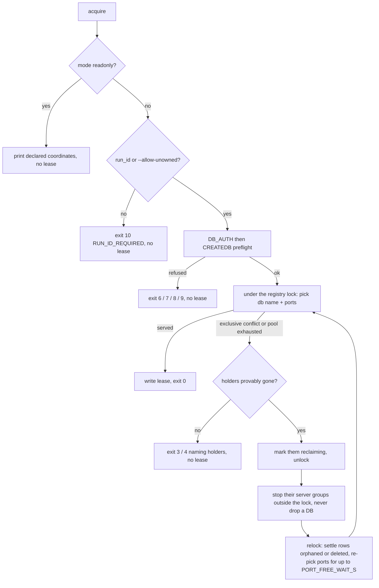
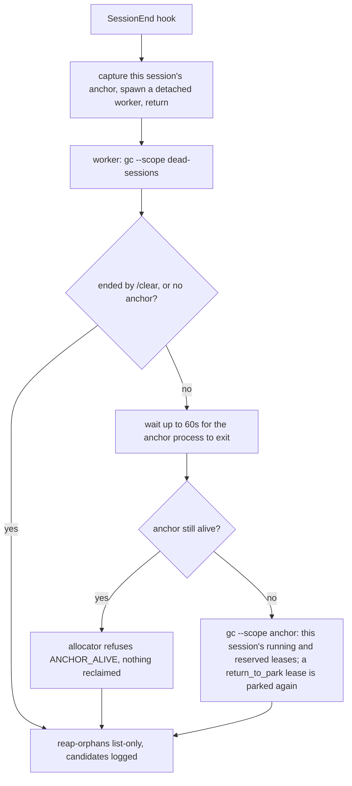

# Odoo instance allocation - liveness, reclamation and failure modes

Part of `docs/reference/INSTANCE-ALLOCATION.md` (index: status, audience, problem, constraints,
goals, and the full parts map). This file owns what keeps a lease alive, what may condemn it, who
may reclaim what, the registry-independent orphan sweep, and the failure-mode matrix. Every value
below is read from `scripts/lib/allocator.py` (`_judge`, `cmd_gc`, `cmd_acquire`) and
`scripts/lib/session_anchor.py`; when this page and that source disagree, the source wins.

### 6.5 `reap-orphans` - DB-side sweep independent of the lease registry

`gc` only ever reclaims a database a LEASE still references. `allocator.py reap-orphans` covers the
class `gc` cannot reach: an ephemeral-shaped database (`<prefix>_t_<hex8>`, never a named or
declared instance) that carries NO lease reference at all, live or condemned - left by a registry
quarantined after corruption, or by a crash in the window between reserving a name and the lease
write landing. Its predicate fails CLOSED on every axis: naming shape + zero lease reference + a
POSITIVELY proven age of at least `--min-age-s` (default 48h, `DEFAULT_REAP_MIN_AGE_S`); an
unreachable cluster is skipped, not assumed empty, and an unmeasurable age is not old enough. The
default is list-only; `--yes` is required to drop.

Because any leased `db_name` is excluded, a PARKED lease's database can never be listed as an
orphan.

The SessionEnd hook (`hooks/session-end-gc.sh`) runs `reap-orphans` in list-only mode after its
`gc` passes and persists the candidates to
`${ODOO_AI_HOME:-$HOME/.odoo-ai}/runtime/reap-orphans-candidates.log`. It never passes `--yes`:
`reap-orphans` scans every declared cluster, not one session's leases, so its destructive half is a
deliberate human `allocator.py reap-orphans --yes` against that log.

## 7. Liveness and reclamation

### 7.1 What protects a lease - the session anchor

Every lease records the long-lived agent process of the session that acquired it, `owner.session`
(`{pid, started, session_id, source, seen_at}`). `session_anchor.discover_anchor` finds it, in
order: `ODOO_AI_SESSION_ANCHOR="<pid>:<fingerprint>"` (the `odoo-local` server exports its own; the
value `none` disables anchoring), else `CLAUDE_PID` (set on every Claude Code Bash tool process,
subagents included), else an ancestor process named `claude`, `codex` or `gemini` (at most 6 levels
up), else none (CI, a human shell). Every subagent of one session shares that anchor.

While the anchor process is alive, the lease is PROTECTED - whatever its server pid, its heartbeat
and its TTL say. No caller heartbeats, re-arms a TTL or runs a keep-alive. (The `odoo-local` server
refreshes `seen_at` on this session's leases every 600s; that stamp only measures the grace window
below.)

`_judge` decides, in this order, and returns the arm that condemns the lease or what protects it:

| # | Rung | Protected when | Condemned as |
|---|------|----------------|--------------|
| 1 | PARKED (`parked_at` present) | inside `park_ttl_s` (default 48h, `DEFAULT_PARK_TTL_S`), or the host rebooted while parked (`parked_boot_id` differs from this boot) | `park-budget-expired` |
| 2 | ANCHORED, any mode but `shared` | the anchor process is alive; or the caller is the same session resumed (same `CLAUDE_CODE_SESSION_ID`), which re-anchors the lease; or, on the AUTOMATIC paths only, less than `ANCHOR_GRACE_S` = 1800s (30 min) has passed since the lease's last touch | `owner-session-ended` |
| 3 | LEGACY / UNANCHORED (and every `shared` row, which is cross-session by design and judged by its server pid alone) | the server pid on this host is alive and its fingerprint matches | `owner-pid-dead` (pid dead on this host), `owner-pid-recycled` (fingerprint proves another process holds the pid) |
| 4 | liveness UNPROVABLE (another host, no pid, a fingerprint that cannot be re-measured) | always on the automatic paths; under an explicit `gc --scope all`, until the TTL arm expires | `ttl-expired-liveness-unprovable` |

An anchor whose state is `unknown` (it cannot be proven either way) falls through to rung 3. "Last
touch" is the latest of `heartbeat_at`, the anchor's `seen_at` and `owner.started_at`.

**The legacy TTL arm (rung 4).** It governs only a lease whose liveness cannot be proven at all, and
only an EXPLICIT `gc` (scope `all`) applies it. The bound is the lease's own `ttl_s` when that was
set explicitly (`acquire --ttl`, recorded as `ttl_explicit`), else at least 24h
(`LEGACY_UNPROVABLE_TTL_S`, also `DEFAULT_TTL_S`) - so an old row carrying a shorter default is
judged against 24h too. `gc --scope dead-sessions` and acquire's capacity path never take this arm.

Pid fingerprints: `owner.pid_fp` is timezone- and locale-independent (`proc:<boot_id>:<starttime>`
on Linux, `ps:<UTC lstart>` elsewhere) and is trusted while `owner.pid_fp_pid` equals `owner.pid`;
otherwise the legacy `owner.pid_started` (bare lstart) is read, compared in the local zone and in UTC,
and never counts as a mismatch (`INSTANCE-ALLOCATION-REGISTRY.md` § 4.2). Direction, for every rung: when unsure, do NOT reap - an
un-reaped orphan costs RAM, a wrongly reaped lease kills a live server and destroys work in
progress.

**The verdict.** `allocator.py list --with-verdict` (and `lease_list`) attaches to every row
`verdict = {state, protected_by, condemn, condemn_auto, anchor_state, anchor_alive}`:
`state` is `running | reserved | parked | orphaned | reclaiming`; `protected_by` is `session |
server-pid | park | ttl | none`; `condemn` is what an explicit `gc` would do, `condemn_auto` what
the automatic paths would do. Consumers (the teardown hook, the MCP server) read it instead of
re-deriving liveness.

**Adopt.** `allocator.py adopt <token> --run-id <id>` (`lease_adopt`) moves a lease onto the
CALLER's anchor - for a lease that must outlive the session that acquired it inside the same run.
It requires the recorded owner run, the same host and an anchored caller, and changes nothing but
who vouches for liveness - except that adopting a PARKED lease sets `owner.return_to_park`.

### 7.2 Who may reclaim what

| Path | Scope | What it may destroy |
|------|-------|---------------------|
| `acquire` | NOTHING implicitly. Only when it cannot otherwise be served (port pool exhausted, or an exclusive conflict) does it take CAPACITY from leases whose owner is PROVABLY gone under the automatic semantics (`owner-session-ended` past the grace window, `owner-pid-dead`, `owner-pid-recycled`; never TTL, parked, shared or already-reclaiming rows) | stops their server group and frees their ports: the row is marked `orphaned` and kept (an exclusive holder's row is deleted). It NEVER drops a database. Recorded as `by_verb=acquire-capacity`, `dropped_db=false`. Still no capacity: exit 3 / 4 naming the `holders` |
| `release` | the one lease, by its owner (`INSTANCE-ALLOCATION-GUARDS.md` §6.3) | stop group -> drop through Odoo (a `drop_on_release` database) -> delete row |
| `gc --scope dead-sessions` | every lease the AUTOMATIC semantics condemn: ended sessions past the grace window, dead or recycled server pids, expired parks; never the TTL arm | stop group -> drop -> delete row |
| `gc --scope anchor --anchor <pid:fingerprint>` | the running / reserved leases (never parked, never shared) of ONE session anchor, default the caller's own. Refused while that anchor lives (`ANCHOR_ALIVE`, exit 3) unless `--force`; no anchor at all is `ANCHOR_REQUIRED` (exit 2). No grace window: the named anchor is checked directly | stop group -> drop -> delete row |
| `gc --scope all` (the default) | every arm of `_judge`, including the legacy TTL arm - a deliberate human sweep | stop group -> drop -> delete row |
| `gc --dry-run` | any scope | nothing: `ALLOC_WOULD_RECLAIM=<token>` per candidate (JSON `action` reclaim\|park). `lease_gc` defaults to a dry run |
| `reap-orphans --yes` | lease-free ephemeral-shaped databases (§6.5) | drops them |

Every signal any of these paths sends goes through ONE gate (`_stop_owner_group_if_local`): the pid
must be on this host, alive, AND proven to belong to the lease - by a matching recorded fingerprint
(`owner.pid_fp`, else `owner.pid_started`), or by an independent observation (an Odoo command line naming this lease's database,
or the process group listening on a port this lease reserved). An unproven pid is never signalled;
the lease is still reclaimed and the refusal is reported with its evidence. Every reclamation is
reported per lease on STDERR and appended to `$ODOO_AI_HOME/logs/allocator-reclaimed.jsonl`.

The acquire path - no sweep; capacity only when it would otherwise refuse:

Session end - scoped to the ending session, plus provably dead owners:

A parked lease survives its session's end on purpose (park is how a session keeps a database for a
later one); its own budget, rung 1, governs it. A lease RESUMED or ADOPTED out of a park carries
`owner.return_to_park`: when any gc path condemns it because its new owner is gone (session ended,
server dead or recycled), it is PARKED again with the budget it had (`ALLOC_PARKED`, JSON `parked`)
instead of being dropped. A parked lease's full token is shown only to its own run (`lease_find`,
`lease_list`).

### 7.3 Two-phase reclamation and the `reclaiming` marker

`gc`, `release` and acquire's capacity path share ONE primitive, so no stop or drop ever stalls
another session's `acquire` or `list`:

1. Phase A, under the registry lock: mark each target row `reclaiming = {by_pid, host, at, ...}`.
2. Phase B, OUTSIDE the lock: stop the server group (and, for `gc` / `release`, drop the database)
   on a detached snapshot.
3. Phase C, under the lock again: settle each outcome - delete the row, keep it (a failed drop), or
   mark it `orphaned` (capacity) - but only on a row that still carries THIS process's marker.

A marked row keeps its ports reserved until settled, so no acquire is handed a port whose server is
still stopping. While another live process holds the marker, `release`, `park`, `resume` and
`adopt` refuse with `RECLAIM_IN_PROGRESS` (exit 11) and `gc` skips the row; `lease_list` shows
`state: reclaiming`. A marker whose process died is ignored, so the next gc / release / acquire
retakes the row; a marker written on another host is honoured for 3600s
(`RECLAIM_MARKER_OFFHOST_S`), then treated as abandoned.

Registry writes are atomic (temp file + `os.replace`). A torn or corrupt registry (JSON parse
failure) is quarantined to `leases.json.bak` and replaced by an empty one, loudly - which is one of
the ways a lease-free database arises for `reap-orphans` (§6.5).

### 7.4 Cross-version - several plugin versions on one host

The registry is machine-global, and every Claude Code session keeps running the allocator of the
plugin version it started with, so an OLDER allocator reads - and on every acquire sweeps - the rows
this one writes. Rows stay safe for it: `owner.pid_started` keeps the legacy bare-`lstart` shape an
older reader compares with `==` (the TZ-free fingerprint lives in `owner.pid_fp`), a row without an
explicit `--ttl` carries `ttl_s` of at least 24h, and `heartbeat` keeps refreshing `heartbeat_at`, the
only stamp that reader's TTL arm reads. Guard: `tests/test_allocator_cross_version.py`.

Residual gaps while a pre-anchor plugin version (7.0.2 or older) still runs anywhere on the host:

- it condemns an anchored lease whose bound server died while its session still lives
  (`owner-pid-dead`) - but only until the next locked write by this allocator (a session
  heartbeat, an acquire, bind, gc or adopt anywhere on the host) sheds that dead pid from the row
  (`owner.server_gone` records it) and leaves it to that reader's heartbeat-refreshed TTL arm. The
  window is at most one `odoo-local` heartbeat interval while any session runs that server, and
  open-ended on a CLI-only host;
- it reaps a pid-less row that no `odoo-local` server heartbeats after 24h;
- it can drop `orphaned` rows.

**After updating the plugin, restart every Claude Code session on the host** so no older allocator
keeps sweeping the registry.

## 8. Failure modes & edge cases

| Risk | Mitigation |
|------|------------|
| Two allocators pick the same port | the flock serialises the read-modify-write; a live probe that binds the way Odoo does (`SO_REUSEADDR` + bind + listen) rejects a port a non-allocator process listens on, while a TIME_WAIT port stays usable. No holder at all yet no bindable port is `PORT_POOL_EXHAUSTED` with reason `ports-busy-outside-registry`. |
| Ephemeral database name collision | uuid8 suffix; an Odoo create-on-init failure is retried with a new acquire. |
| A subagent ends while its lease is live | the lease is protected by the SESSION, not the subagent. The SubagentStop teardown gate (`INSTANCE-LIFECYCLE-TEARDOWN.md`) blocks the subagent until it releases, parks or hands the lease off by name. |
| The session ends normally | the SessionEnd hook reclaims that session's running and reserved leases (`gc --scope anchor`) once its anchor process has exited (§7.2). Parked leases survive. |
| The session is killed (`-9`, OOM) | its anchor dies with it. Its leases stay protected for `ANCHOR_GRACE_S` after their last touch (a `claude --resume` of the same session id re-anchors them), then any later `gc --scope dead-sessions` - the next session to end on this host - reclaims them. A server that survives the session is stopped only if its pid is proven to be that lease's own. |
| A lease with no provable liveness (another host, no pid, no anchor) | never touched by an automatic path; only an explicit `gc --scope all` past the legacy TTL arm (at least 24h) reclaims it. |
| Postgres unreachable | `acquire` refuses fast with exit 9; never silently shares a database. |
| `$ODOO_AI_HOME` on a network FS without working flock | the registry must live on a local FS; setup checks and warns. |
| Old `instances.toml` with no pool fields | the pool is derived from `http_port`; fully backward compatible. |
| Old registry rows (schema v1/v2) | read leniently: a row without `owner.session` is judged by rungs 3-4. There is no bulk migration. |
| Host reboots while a lease is parked | `parked_boot_id` differs from the current boot id, so the park budget is treated as not consumed and the row stays resumable. `resume` re-stamps the boot id. |
| The parked lease's database was dropped externally | two probes, only the first pre-launch: `query --state parked` (`lease_find`) skips a lease whose database is provably gone and names `release <token>`; `resume` probes again and refuses with exit 5. `release` then handles it on its "absent" branch (`ALLOC_FORGOTTEN_DB`, `INSTANCE-ALLOCATION-GUARDS.md` §6.7). An undeterminable probe refuses at neither rung. |
| Port collision on resume | the parked lease still holds its `ports`, so no allocator caller can take them; a non-allocator process still can, and `50-instance-spinup.sh`'s identity-marker attach guard (`INSTANCE-ALLOCATION-MODES.md` §5 P6.2) refuses a foreign listener BEFORE any launch. |
| Two agents race to resume one parked lease | `resume` is a locked compare-and-set requiring `parked_at`; the loser finds a live same-host owner pid and gets exit 6, so it stops the server it just launched instead of binding over the winner. |
| A resume refused AFTER the launch (exits 1/4/5/6) | no path may end with a live server the teardown gate cannot see: a refused resume leaves the lease parked, and the gate skips parked rows. `50-instance-spinup.sh::_bind_exclusive` therefore stops the process group it just launched and fails the apply, leaving the lease exactly as it was. |
| A reclaimer dies between phases | its marker is ignored once its process is gone (§7.3); the next gc / release / acquire retakes the row. |

## 9. Timing constants

All in `scripts/lib/allocator.py` (SSOT) unless noted:

| Constant | Value | Governs |
|----------|-------|---------|
| `ANCHOR_GRACE_S` | 1800s (30 min) | how long the automatic paths spare a lease whose session is provably dead, from its last touch |
| `LEGACY_UNPROVABLE_TTL_S` = `DEFAULT_TTL_S` | 24h | the floor of the legacy TTL arm (explicit `gc --scope all` only) |
| `DEFAULT_PARK_TTL_S` | 48h | a parked lease's budget (`park --park-ttl` overrides) |
| `DEFAULT_REAP_MIN_AGE_S` | 48h | the minimum proven age of a `reap-orphans` candidate |
| `RECLAIM_MARKER_OFFHOST_S` | 3600s | how long another host's `reclaiming` marker is honoured |
| `PORT_FREE_WAIT_S` | 5s | how long acquire re-picks ports after its capacity path stopped a server |
| `HEARTBEAT_INTERVAL_S` (`scripts/mcp/odoo_local/tools_lease.py`) | 600s | the `odoo-local` server's `heartbeat --session mine` cadence |
| `ANCHOR_WAIT_S` (`hooks/session-end-gc.sh`) | 60s | how long the SessionEnd worker waits for the ending session's anchor to exit |
