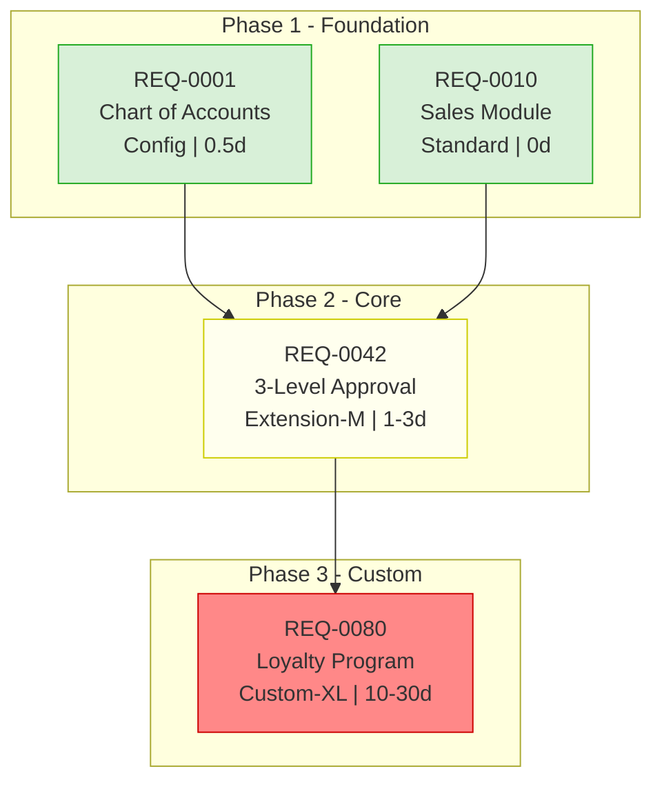

# Phase D - Dependency DAG Reasoning Reference

> Live reference for `odoo-brl` Phase D. Read this file when running Phase D.
> Architecture: see `docs/reference/workflow-harness.md`.
> Output schema: `reference/schema.md` §dag.json.

---

## Overview

Phase D runs once, after every chunk has completed Phase A+B+C (all requirements classified
and costed in `results.jsonl`). It is a **bolt-on**: it reads the finished `results.jsonl`,
produces `dag.json` + `dag.mermaid`, and back-fills `dependencies` + `impl_phase` on each row.
It never re-runs classification or cost.

It produces three kinds of dependency edge:

| Edge type | Meaning | Source |
|---|---|---|
| `technical` | Module A must be installed before module B (Odoo manifest `depends`) | `module_inspect(method='dependencies', odoo_version='auto')` (deterministic) |
| `business-logic` | Requirement B's business process needs A done first | Opus reasoning (no MCP tool) |
| `data-flow` | Requirement B needs master data produced by A | Opus reasoning + (optional) `model_inspect` |

`impact_analysis` is NOT used — it is reverse direction (blast radius), wrong for forward
planning.

---

## Algorithm (cluster-cut heuristic)

Pairwise reasoning is O(n^2) (1000 items ~= 500k pairs) — infeasible. Phase D bounds the work
by grouping requirements into clusters and reasoning only **inside** each cluster.

```
D1. Technical bootstrap (deterministic, parallel MCP <=3):
    modules = unique non-null module across results.jsonl
    for module in modules:
        module_inspect(name=module, method='dependencies', odoo_version='auto')   # -> {"depends": [...]}
    -> tech_dep = {module -> [depends_on_modules]}
    cache under key deps:<module>:<version> for resume.

D2. Cluster-cut:
    cluster_key(req) = (module_family, business_domain)
      module_family   = root module from classification (account, sale, stock, mrp, hr, ...)
                        Custom items with no module -> module_family = "custom"
      business_domain = LLM tag from req_category / req_text
                        (Finance, Sales, Inventory, Manufacturing, HR, Procurement,
                         Project, CRM, Cross-cutting)
    Group reqs by cluster_key. Target 8-20 clusters.

    *** HEURISTIC BOUND (acceptance I6): cluster size cap = 120 requirements/cluster. ***
    Opus reasons over at most 120 items per cluster (fits one context window).
    If a cluster > 120 items: SPLIT deterministically before D3 by a secondary key
    (priority bucket Must/Should/Nice, then req_id range) into <=120-item sub-clusters,
    suffixing the id (account-Finance#1, account-Finance#2, ...).
    Record every split in dag.json.meta.cluster_caps. This cap is the load-bearing reason
    Phase D stays tractable at thousands of items.

D3. Intra-cluster reasoning (Opus, per cluster, <=120 items):
    For each cluster, run the Opus cluster prompt below (input = that cluster's req-list,
    output = {edges:[{from,to,type,reason}]} JSON, edges only WITHIN the cluster).
    - Default: inline, sequential, one cluster at a time.
    - When >10 large clusters: one context:fork Opus subagent per cluster (depth-2 max);
      subagent prompt MUST carry the hard-rules line. Each returns ONLY its edges JSON (<=2k).

D4. Inter-cluster edges (technical module deps + business-affinity for Custom):

    Part A — Technical module deps (deterministic):
    for each ordered (cluster_A, cluster_B):
        if module_family(A) depends_on module_family(B) in tech_dep:
            add ONE representative technical edge:
                from = earliest req (lowest req_id) in cluster_B
                to   = earliest req in cluster_A
            type="technical", reason="module <A> depends on module <B> (manifest)"

    Part B — Business-domain affinity for Custom clusters (LLM-reasoned, bounded):
    Custom items carry module_family="custom" and produce NO technical edges from Part A.
    To avoid silently dropping their cross-cluster dependencies:

    custom_clusters = [c for c in clusters if c.module_family == "custom"]
    for each custom_cluster C:
        # Reason at the CLUSTER level (not item level) about which non-custom clusters
        # C's requirements most plausibly depend on for their business context.
        # Use req_text + business_domain tag of C's items as input.
        # Example: "custom-Sales" cluster with loyalty / discount requirements
        #          -> depends on "sale-Sales" cluster (base SO flow must exist first).
        # Example: "custom-Finance" cluster with VN tax reporting
        #          -> depends on "account-Finance" cluster (chart of accounts + tax setup).
        dependent_on = LLM_reason(C, non_custom_clusters)  # list of (source_cluster, reason)
        BOUND: emit at most ONE edge per (C, source_cluster) pair.
        for each (S, reason_str) in dependent_on:
            add edge: from = earliest req in S, to = earliest req in C
            type="business-logic"
            reason="custom cluster '{C.id}' requires '{S.id}' domain first: {reason_str}"

    Heuristic bound: O(|custom_clusters| x |non_custom_clusters|) cluster-level inferences
    (not O(n^2) item pairs). A custom cluster with no clear domain affinity emits zero edges.
    Record D4-B edge count in dag.json.meta.custom_affinity_edges.

    (one representative edge per ordered cluster pair -> O(C^2), DAG stays sparse)

D5. Kahn topological sort + cycle detection on union(intra ∪ inter ∪ technical).
    -> topological_order, phases (in-degree-0 peel layers), cycles[].
    Write impl_phase back onto every results.jsonl row.

D6. Critical path: EST/EFT over effort_days_max -> critical_path[] + critical_path_days.
```

Work reduces from O(n^2) global to O(Σ k_c^2) intra-cluster + O(C^2) inter-cluster
representative. For 1000 items / 15 clusters: ~37k intra + 225 inter ≈ 7% of full pairwise.

---

## Opus cluster-reasoning prompt (cluster-scoped)

Use this verbatim per cluster in D3. `{module_family}`, `{business_domain}`, and the
requirement list are interpolated by the engine. Output is consumed as JSON.

```
SYSTEM: You are an Odoo implementation architect.

You are given ONE cluster of classified BRL requirements that share a module family
({module_family}) and business domain ({business_domain}). Identify hard dependency
relationships BETWEEN requirements IN THIS CLUSTER ONLY.

Emit a directed edge from -> to ONLY when:
  - `to` CANNOT be implemented before `from` is complete (a hard dependency, not a nicety).
Label each edge with exactly one type:
  - business-logic : `to`'s business process requires `from`'s process to exist first
  - data-flow      : `to` needs master data created/configured by `from`
(Do NOT emit `technical` edges here — module install order is handled separately by the engine.)

Reason only within this cluster's <=120 requirements. Do NOT invent requirements not listed.
If two requirements are independent, emit no edge. Keep the graph sparse — only true blockers.

OUTPUT FORMAT (JSON only, no prose, no markdown fence):
{
  "cluster_id": "{module_family}-{business_domain}",
  "edges": [
    {"from": "REQ-XXXX", "to": "REQ-YYYY", "type": "business-logic", "reason": "<=120 chars"}
  ]
}
If there are no intra-cluster dependencies, output: {"cluster_id": "...", "edges": []}

CONSTRAINTS (when this runs as a subagent):
- KHÔNG spawn sub-agent. KHÔNG invoke Skill tool. CHỈ Read/Grep/Glob/Write.
- Output ONLY the JSON object. No surrounding text.

REQUIREMENTS IN THIS CLUSTER:
[engine pastes: req_id | req_text | classification | module | effort_tier | effort_days_max]
```

---

## Kahn topological sort (pseudocode)

```python
from collections import deque, defaultdict

def kahn(requirements, edges):
    """requirements: list[req_id]; edges: list[(from, to)] meaning from-before-to.
    Returns (order, phases, cycle_members)."""
    in_deg = {r: 0 for r in requirements}
    adj = defaultdict(list)
    for src, dst in edges:
        adj[src].append(dst)
        in_deg[dst] += 1

    # Phase assignment = layered peel of in-degree-0 frontiers.
    order, phases, remaining = [], {}, dict(in_deg)
    frontier = [r for r in requirements if remaining[r] == 0]
    phase = 1
    while frontier:
        phases[phase] = sorted(frontier)
        nxt = []
        for n in frontier:
            order.append(n)
            for m in adj[n]:
                remaining[m] -= 1
                if remaining[m] == 0:
                    nxt.append(m)
        frontier, phase = nxt, phase + 1

    cycle_members = [r for r in requirements if r not in order]  # never emitted => in a cycle
    return order, phases, cycle_members
```

`order` is the implementation sequence. `phases` maps phase number -> req_ids (becomes
`impl_phase`). `cycle_members` is empty for a valid DAG.

---

## Cycle detection + resolution

If `cycle_members` is non-empty, a circular dependency exists. The engine MUST:

1. Record the cycle members in `dag.json.cycles` (and surface them in the GATE E summary).
2. Present THREE resolution options for the implementor to choose — never silently drop an edge:
   - **split** — break a requirement into a phase-A part (done early) and a phase-B part (later),
     cutting the back-edge.
   - **manual** — mark the cycle members for manual implementor ordering; leave them unordered
     in the topo result but flagged.
   - **shared-prereq** — introduce a new shared prerequisite (e.g. a base setup requirement)
     that both cycle members depend on, removing the mutual edge.
3. Still emit a partial `topological_order` for the acyclic remainder so the rest of the plan
   is usable.

A cycle is a REPORTED outcome, not a crash and not a silent edge-drop.

---

## Critical path (EST / EFT)

Over the acyclic DAG, with node weight = `effort_days_max`:

```
EST[n] = max(EFT[p] for p in predecessors(n)), or 0 if none
EFT[n] = EST[n] + effort_days_max[n]
critical_path_days = max(EFT.values())
critical_path = backtrace from argmax EFT, following the predecessor that set each EST
```

---

## Mermaid format

`flowchart TD`, requirements grouped into `subgraph` by `impl_phase`. Node label =
`REQ-ID\n<short req_text>\n<effort_tier> | <days>`. Edges follow `topological_order`.



Node style by classification class:

| Class | Fill / stroke |
|---|---|
| `Available-in-Odoo-CE` | `fill:#d8f0d8,stroke:#2a2` (green) |
| `Available-in-Odoo-EE` | `fill:#ffe,stroke:#cc0` (yellow) |
| `Available-in-Viindoo` | `fill:#e8d,stroke:#808` (purple) |
| `Custom` | `fill:#f88,stroke:#c00` (red) |

For very large BRLs, collapse to a phase-level view (`graph LR` with one subgraph per phase
and phase-to-phase arrows) to keep the diagram renderable.

---

## References

- `reference/schema.md` §dag.json — output schema
- `docs/reference/workflow-harness.md` — harness architecture and DAG layer design
